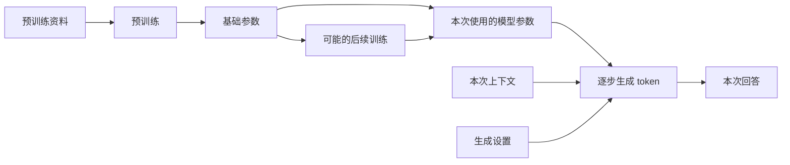

## 第一章　从一个语言模型说起

假设你在聊天框里问：“台北今天会下雨吗？我要带伞吗？”几秒后，屏幕上出现一句自然流畅的回答。这个界面很容易让人产生一种印象：屏幕后面有个随时知道天气、能记住你、还能替你办事的对象。

要理解 Agent，先把这幅图拆开。语言模型负责根据输入生成输出；聊天程序负责保存和整理消息；天气服务负责提供实时数据；运行框架负责让前面几部分协作。本章只看第一部分：**语言模型怎样学会生成文字，它回答时实际做了什么，以及它为什么会自信地说错。**

### 1.1 训练：模型的能力从哪里来

先看一个普通程序。你写下规则：“如果降雨概率超过 60%，建议带伞。”程序执行时会按这条规则计算。语言模型的工作方式不同：开发者通常不会手写数以亿计的“如果用户问 X，就回答 Y”。训练程序给模型大量样例，让它调整内部的数值参数，使它在训练任务上逐渐减少错误。

对本书关注的生成式语言模型，一个常见的预训练任务是：给出一段文字的前面部分，预测后面将出现的 token。例如看到“乌云密布，出门最好带一把”，模型应给“伞”较高的概率。训练会反复比较预测与样例中的后续内容，并调整模型参数。真实训练比这个例子复杂得多，但“通过大量样例调整参数”是理解它的第一步。自回归语言模型的研究可以作为这种训练方式的实例。[Language Models are Few-Shot Learners](https://arxiv.org/abs/2005.14165)

把一次训练迭代简化来看，大致会发生这些事：

1. 把训练文本切成 token，并取其中一段作为样例。
2. 让模型预测样例中各位置的后续 token。
3. 比较预测与样例，得到一个表示误差的数值，常叫“损失”。
4. 根据误差调整模型参数，让类似样例下的预测有机会变好。
5. 在大量样例上重复，并用单独的评估观察模型是否真的改进。

这里的“参数”是模型内部的数值，不是一条条可直接搜索的原文记录。研究确实发现过模型复现训练片段的情况，但不能把它理解成一座总能准确取回原文的图书馆；从它的回答也不能直接推断某个句子是否出现在训练材料里。[Extracting Training Data from Large Language Models](https://www.usenix.org/conference/usenixsecurity21/presentation/carlini-extracting)

为什么学“接下来写什么”会带来解释、翻译、编程等能力？因为要在各种文本中预测得好，模型必须学到词语关系、常见事实、语法、代码结构、不同文体以及某些推理模式。不过，这种训练目标并没有给每一句输出附上“事实已核验”的保证。训练材料里可能有错误、过时信息和互相矛盾的说法；模型也可能没有充分学会某个知识点。

许多面向对话的模型还会经过后续训练，让它更适合遵循指令、回答问题或表达不确定性。常见方法包括用人工编写的问答样例做微调，以及利用人类偏好信号继续改进输出。具体流程因模型而异，不能假设每个产品都用了完全一样的步骤。[Training language models to follow instructions with human feedback](https://arxiv.org/abs/2203.02155)

这里先记住两个时间段：

| 时间段 | 发生什么 | 对用户意味着什么 |
|---|---|---|
| 训练时 | 调整模型参数，形成可重复使用的能力 | 新训练后的模型可能在许多任务上表现不同 |
| 回答时 | 用现有参数处理本次输入并生成输出 | 聊一次天通常不会当场改写模型参数 |

模型可以在回答时利用你刚提供的资料；这叫使用**当前上下文**，不是重新训练。后面讨论“记忆”时，这个区别会反复出现。

### 1.2 同一个问题，可以在三个层次上改进

假设天气助手总把“台北”误解成台北县，或者不知道今天的降雨概率。开发者可以从三个层次处理问题，但它们改变的东西不同：

| 做法 | 改变什么 | 适合解决什么问题 |
|---|---|---|
| 预训练 | 用大量资料训练模型的基础参数 | 形成通用语言、代码和知识能力；通常由模型提供者完成 |
| 后续训练 | 在已有模型上继续调整参数 | 改善遵循指令、特定任务格式或回答风格 |
| 提供当前上下文 | 在这次请求中放入说明、例子、文件或工具结果 | 让模型利用本轮所需的具体资料，不改变模型参数 |

如果问题是“今天台北降雨概率多少”，重新训练一个模型通常没有必要。更直接的办法是查天气，并把带有时间和地点的结果放进本次上下文。如果问题是模型长期不懂某种专业格式，后续训练才可能值得考虑；即便如此，训练也不能代替实时数据。

生成设置又是第四件事。调高或调低采样随机性，会影响模型从候选 token 中怎样选择，可能改变措辞和多样性；它既不添加新资料，也不修正训练材料中的错误。把“回答更稳定”当成“答案更真实”，是一个常见误会。

**图 1-1　训练形成参数，本轮输入参与生成（示意）**



这张图把参数形成与本次生成放在两条输入线上。普通对话中的新资料进入“本次上下文”；它不会因为出现在回答里，就自动流回训练过程。

### 1.3 Token：模型读写文字的单位

人在界面里看到的是句子、气泡和文件。模型处理的输入会被切分并编码成一串 **token**。一个 token 可能对应一个汉字、一个词的一部分、标点或其他片段；不同模型的切分规则不同。因而，字符数、词数和 token 数不能直接画等号。

可以把 token 想成模型处理文本时使用的编号，但不要把它误认为一个固定的“字”。例如一句中文、一个英文单词、一段代码在不同分词器下可能被切成不同数量的 token。模型服务经常按输入和输出 token 统计用量；上下文容量也通常用 token 衡量。第五章会再讨论怎样分配这项容量。

### 1.4 预测下一个 token，怎样变成一整段回答

模型收到本次输入后，会给下一位置的候选 token 分配概率，再按生成设置选出一个。它把选出的 token 接到已有内容后面，继续计算下一个位置。循环进行，直到遇到结束条件或长度限制。

下面的数字只是帮助理解的假设例子，不是任何真实模型的输出：

```text
已有文字：出门最好带一把

候选 token：
伞      0.82
雨衣    0.09
水      0.03
其他    0.06

选出“伞”后，模型再预测后续内容。
```

因此，“预测下一个 token”描述的是**输出如何一步步形成**，不等于模型只会机械地猜一个词，更不等于它没有学到复杂模式。输入中若有代码、表格、任务说明和例子，它也会利用这些上下文生成相应格式的结果。

生成设置会影响候选 token 的选择。例如，提高随机性可能让表达更多样；降低随机性通常让输出更稳定。但再稳定的生成也不会自动验证事实。即使两次给出同一句错误答案，它也仍然是错误的。

还要区分“某个 token 在当前上下文下概率高”和“整句陈述可信”。如果大量文本都写错了某个常识问题，一个常见的错误答案也可能很容易被生成。模型输出的流畅程度、细节多少以及生成概率，都不能直接当作事实置信度。

现代语言模型常用 Transformer 架构。直观地说，其中的注意力机制让模型在处理一个位置时，利用输入中其他相关位置的信息。例如解释“它”指什么，模型可能需要联系前文。现在不必掌握矩阵计算；本书讲到上下文和 KV cache 时，再回头看这种“利用前文”的计算成本。[Attention Is All You Need](https://arxiv.org/abs/1706.03762)

### 1.5 一次回答、一次会话和长期记忆

你在聊天产品里连续提问，感觉是在与同一个对象持续交谈。但从应用开发角度看，很多模型接口可以按“请求—响应”调用：程序发来本次消息，模型返回本次结果。下次调用要让模型知道先前聊过什么，应用通常要保存并重新提供相关历史；有些托管服务会替应用管理会话，这仍属于服务层的功能。

假设第一轮是：

```text
用户：我住在台北。
模型：明白了。
```

第二轮只发送“我住的城市今天会下雨吗？”，却没有附上第一轮内容，也没有其他保存并取回的机制，模型就未必知道“我住的城市”指台北。反过来，如果程序把“用户住在台北”放进第二次请求，模型就可以利用它回答。

这产生三个不同概念：

- **模型参数**：训练形成的能力和统计模式，通常不会因一次普通聊天而更新。
- **当前上下文**：这一次请求实际交给模型的消息、资料和工具结果。
- **应用记忆**：程序在请求之外保存的信息，需要时再取回并放入上下文。

第五章会进一步讨论：即使应用保存了完整会话，也不代表每次都要把全部历史发给模型。

### 1.6 幻觉：流畅为什么不等于真实

如果你问一个模型：“请列出某篇并不存在的论文的作者、年份和页码”，它可能给出一组看似完整的书目信息。这类**看上去合理、却缺乏事实依据或与事实不符的输出**，通常被称为“幻觉”。它也可能表现为编造网页内容、错误转述文件、凭空添加数字，或把不确定的猜测说成确定结论。

“幻觉”这个词很形象，但容易让人误以为模型像人一样看见了什么。工程上更有用的问法是：**这个结论由什么输入支持？有没有可以独立检查的证据？**

它不只发生在开放式问答里。例如总结一份文件时，模型可能把文件没有写的建议塞进“摘要”；引用资料时，可能把真实论文配上错误页码；写代码时，可能调用一个并不存在的函数。这几种错误的检查方式也不同：分别要核对原文、书目信息和真实接口。

为什么会发生？原因不止一个：

1. 生成过程优化的是符合训练和后续训练目标的输出，并没有内置一个对每句话做事实核查的步骤。
2. 当前输入可能缺少回答所需的资料，例如今天的天气、最新价格或一份尚未提供的文件。
3. 模型可能把相似事件、人物或数字混在一起，或者在信息不完整时补出貌似连贯的细节。
4. 用户的问题也可能带着错误前提；模型若直接顺着前提回答，就会放大错误。

例如“台北今天会下雨吗”需要实时天气信息。若模型没有天气工具、网页或用户提供的可靠数据，合理的回答应说明无法确认实时天气；凭印象给出“今天降雨概率 70%”就是没有依据的具体数字。即使连接了天气工具，也要看工具返回的数据时间、地点和是否成功，不能因为工具曾被调用就认定最终答案一定正确。关于模型会重复常见错误说法的问题，可参见 [TruthfulQA 研究](https://arxiv.org/abs/2109.07958)。

减少这类错误有几个层次：让模型承认信息不足；提供可核对的资料；对实时问题调用可靠工具；在输出前核对关键数字、引文和操作结果。它们都能改善可靠性，却不能把模型变成永不出错的事实数据库。第八章和第十章会分别讨论故障处理与评估。

### 1.7 模型的能力边界

单独的语言模型可以根据给定输入解释、总结、分类、翻译，也能生成代码、命令、计划或结构化数据。它可以判断资料似乎不足，并提出应该查询什么。

但如果没有额外连接，它无法直接确认刚发生的事件、读取你电脑上的文件、运行它写出的代码、修改数据库或发送邮件。它写出一条命令，并不等于命令已经执行；它说“我查了天气”，也不等于真的查过。

把这几个动作分开，是后续所有章节的基础：

```text
模型生成“应该查天气”
        ↓
程序判断是否允许查询
        ↓
天气工具执行并返回结果
        ↓
模型根据结果组织回答
```

第二章会给这段程序、工具和完整应用分别命名。等这些角色清楚了，我们才能准确讨论 Agent 怎样从“会说”变成“会做”。

### 本章小结

- 训练通过样例调整模型参数；普通对话主要是在使用已有模型处理当前输入。
- 预训练、后续训练、提供当前上下文和调整采样，分别作用于不同层次。
- 生成式语言模型逐步预测并选出 token；流畅的文字不自动保证真实。
- 会话历史和长期记忆由应用管理，模型本次能用到什么取决于它实际收到什么。
- 幻觉应从“结论有没有依据、能否核对”来处理。
- 模型提出行动与外部程序真正执行行动，是两件事。

### 想一想

1. 用户只在上周的一次对话里说过自己住在台北。今天的新会话中，模型一定知道这件事吗？还缺少什么条件？
2. 模型写出一段能读取文件的 Python 代码，是否表示它已经看过文件内容？
3. 一个回答附带了精确的论文标题和页码，哪些步骤能帮你判断它是否可信？
