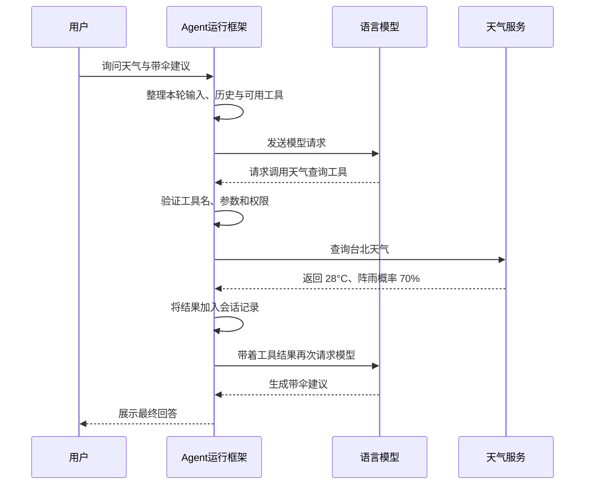

## 第二章　模型、工具、Agent 与运行框架

### 2.1 四个角色

| 角色 | 职责 | 天气例子 |
|---|---|---|
| 语言模型 | 理解输入，生成下一步或最终回答 | 判断需要实时数据，提出查天气的请求 |
| 工具 | 执行一项范围明确的操作 | 根据城市名称查询天气 |
| 运行框架（Harness） | 准备请求、执行工具、保存结果、控制流程 | 验证查询请求、调用天气服务，再把结果交给模型 |
| Agent 应用 | 把模型、运行框架、工具、状态和规则组合成可完成任务的应用 | 从提问到查天气再到给出建议的完整助手 |

“Agent”不是一种特殊的模型结构。通常它指一个由模型驱动、可以观察结果并采取行动的应用系统。一个只调用模型一次并展示回答的聊天程序，也可以使用大语言模型，但它没有典型的多步行动循环。

“Harness”也不只是一个提示词或一个 `while` 循环。它是模型周围的运行环境：决定模型能看到什么、能请求哪些工具、哪些操作可以执行、发生错误时怎么办，以及何时结束。

### 2.2 一条完整的行动链

考虑用户的问题：“台北现在天气怎么样？我出门要带伞吗？”

可以把责任归纳为：**模型决定并提出下一步，运行框架检查并执行，工具返回可观察的结果，模型再根据结果继续。**

这种分工很重要。模型提出“删除这个文件”，不代表文件已经被删；只有运行框架允许并执行了删除操作，才会产生实际变化。

