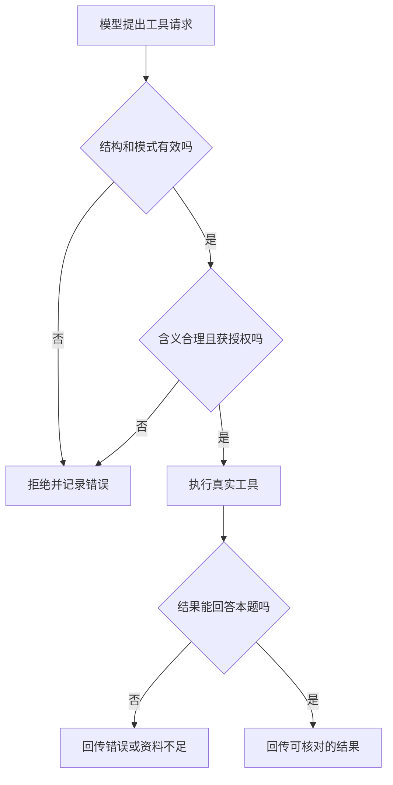

## 第三章　模型怎样请求工具

第二章把“模型提出动作”与“程序执行动作”分开了。本章继续往下看：两边用什么格式交接，运行框架怎样验证请求，以及工具应返回怎样的结果。天气查询是一个方便的起点，因为它主要读取信息；文件编辑则能暴露权限与重复执行的问题。

### 3.1 工具说明是一份接口契约

运行框架把可用工具的名字、用途和参数格式告诉模型。一个简化的天气工具可以这样描述：

~~~json
{
  "name": "get_weather",
  "description": "查询指定城市的天气预报；返回地点、发布时间和适用时段",
  "parameters": {
    "type": "object",
    "properties": {
      "city": {
        "type": "string",
        "description": "城市名称，例如台北"
      }
    },
    "required": ["city"],
    "additionalProperties": false
  }
}
~~~

参数部分使用了 JSON Schema 的常见写法。它说明 city 必填、类型为字符串，而且不接受未列出的额外字段。实际模型 API 对 JSON Schema 的支持范围会不同，代码应按所用服务的文档验证；本书的示例只表达接口思想。

工具说明像函数签名加注释。它可以帮助模型选择工具，但还需要程序中存在真正的实现。名字、说明、参数规则和返回数据最好保持一致：如果说明写“查询当前天气”，工具却返回一周前的缓存值，模型可能据此给出错误建议。工具名称也应清楚地区分读取和修改，例如 read_file 与 write_file。工具设计研究强调，含糊的名称和参数会让 Agent 更容易选错工具或填错参数。[Writing effective tools for AI agents](https://www.anthropic.com/engineering/writing-tools-for-agents)

### 3.2 一次调用分为请求、执行和回传

模型可能返回这样的结构化内容。call_id 是为了把本次请求与稍后的结果对应起来；不同 API 的字段名可能不同。

~~~json
{
  "call_id": "call_001",
  "name": "get_weather",
  "arguments": {
    "city": "台北"
  }
}
~~~

运行框架收到它后，还没有天气数据。程序要找到 get_weather 的实现，检查参数、权限与任务状态，然后调用天气服务。假设服务返回以下示意结果：

~~~json
{
  "call_id": "call_001",
  "ok": true,
  "data": {
    "city": "台北",
    "issued_at": "示例发布时刻 08:00",
    "forecast_for": "示例当天 18:00—24:00",
    "rain_probability": 0.70
  }
}
~~~

之后，运行框架把结果按模型接口要求加入消息，再请求模型。第二次请求中，模型才有依据说“示例预报显示台北今晚降雨概率较高，建议出门前再核对”。这里的 0.70 只是演示数据；真实应用还要确认预报时段、发布时刻和用户出门的时间是否对应。

当一次模型响应里有多个工具请求时，call_id 更重要：每条结果都应对应正确的请求，不能把新北的天气接到台北的调用下面。DeepSeek 的工具调用示例展示了“模型提出函数调用、应用执行并回传结果、模型继续生成”的基本链路。[DeepSeek API：工具调用](https://api-docs.deepseek.com/guides/tool_calls/)

### 3.3 验证不止是检查 JSON 能否解析

从模型输出到真实操作，至少有六道不同检查：

1. **结构**：返回的是工具请求吗？参数是否为完整对象？输出有没有被截断？
2. **模式**：工具名是否在清单内？city 是否为字符串？是否有多余字段？
3. **含义**：city 是可识别的城市吗？“台北或新北都可以”是否需要澄清？
4. **授权**：当前用户、任务和运行环境是否允许调用这个工具？
5. **执行**：服务是否成功返回？是否超时、限流或提供空结果？
6. **结果**：返回的地点、时间和字段是否足够回答当前问题？

第一、二步可以大量依赖机器规则；第三和第六步需要结合业务语义。第四步必须由应用的权限逻辑决定，不能委托模型自行宣称“我有权限”。这些检查回答不同问题：一个参数可以通过 JSON Schema，却仍指向不允许访问的文件路径；一份合法结果也可能因时间过旧而不能回答“现在”。

**图 3-1　工具请求跨过程序边界前的检查（示意）**



图中的“拒绝”发生在真实工具执行之前；执行成功后的结果检查则回答另一件事：这份数据是否真的足以完成用户目标。

不要直接把 arguments 拼进 shell 命令或 SQL。把它当作普通外部输入，用参数化接口、路径规范化和权限检查处理。第三方工具返回的文本也应作为数据，而不是下一轮的新授权；第九章会讨论提示注入。

### 3.4 原生工具调用、JSON 输出和语义正确性

许多模型 API 提供独立的工具调用字段。运行框架直接读取工具名、参数和调用标识，比从自然语言回答中猜测“它是不是想调用工具”可靠。没有原生工具调用时，也可以约定模型输出 JSON，但要处理多余文字、缺失引号和不完整内容。

结构化输出功能还可能进一步约束结果符合给定模式。要区分三个层次：

| 层次 | 说明 | 仍需检查的事 |
|---|---|---|
| 合法 JSON | 文本能被 JSON 解析器读取 | 字段是否齐全、类型是否正确 |
| 符合模式 | 字段与类型满足指定 Schema | 城市是否合理、权限是否允许 |
| 业务正确 | 操作与用户目标相符，结果足够回答 | 数据是否最新、结论是否真的由结果支持 |

某些服务能较强地保证符合受支持的模式；不同服务对拒绝、截断和并行工具调用的处理不同。即使模式完全匹配，也不能由此推出参数指向了正确城市，更不能推出操作已获授权。[OpenAI Structured Outputs 文档](https://developers.openai.com/api/docs/guides/structured-outputs)

### 3.5 工具结果要让下一步容易判断

一个有用的工具结果应当既方便模型理解，也方便程序检查。天气结果至少应说明查询地点、数据时间、关键数值和状态。失败时，不宜只返回一大段“出错了”。可以明确区分：

~~~json
{
  "call_id": "call_001",
  "ok": false,
  "error": {
    "code": "TIMEOUT",
    "message": "天气服务在规定时间内没有返回"
  }
}
~~~

程序可据 error.code 决定是否有限重试；模型可据 message 告诉用户当前无法给出可靠天气。权限拒绝应有不同错误码，通常不应自动重试。工具结果还应有限长：网页、日志和文件若过长，要指出截断或分页位置，让运行框架按需继续读取，而不是把整份内容塞进模型上下文。

对于修改文件的工具，返回值应包含目标路径、执行状态以及可供检查的信息。编辑工具返回“成功”只是操作反馈；若用户要求“保留其他内容”，还应读取差异或运行适当检查，确认副作用没有超出目标。

### 3.6 什么时候可以并行

假设用户问：“台北和新北哪个地方更可能下雨？”两次查询不互相依赖，运行框架可以并行发出：

~~~text
get_weather("台北") ─┐
                     ├→ 收集两条结果 → 模型比较
get_weather("新北") ─┘
~~~

并行能缩短等待，但要保存每条请求的标识、城市和结果。若台北成功、新北超时，不能把任务标成“两个城市都已查到”。可以有限重试失败的一条，或明确告知比较尚不完整。

另一个任务可能是“先搜索文件路径，再读取找到的文件”。第二步依赖第一步的结果，不能盲目并行。对会修改状态的工具还要考虑执行顺序：先写文件再检查，与先检查再写文件，含义不同。

### 3.7 一个常见边界错误

假设模型请求 write_file(path="../../secret.txt", content="...")。格式可能完全合法，但路径经过规范化后指向允许目录之外。运行框架应拒绝并返回权限错误。反过来，若模型请求 read_file(path="index.html")，权限和格式都通过，文件仍可能不存在；这时要把“未找到”交回模型，让它决定是否搜索其他位置或询问用户。

因此，工具接口设计有两面：**让模型容易选对并填对**，以及**让程序能够检查并安全执行**。只优化工具说明而不做验证，或只设置权限却让工具结果含糊，都不足以支撑可靠的 Agent。

### 3.8 流式输出时，片段还不是完整请求

有些模型接口会一段段传回文字和工具调用字段，让界面更早显示内容。对用户可见的文字，这通常只是呈现方式；对工具调用，分段返回会影响执行时机。工具名、调用标识和 JSON 参数可能分布在多个片段中，半截参数如 `{"city":"台` 不能拿去调用工具。应按同一次调用的标识与索引收集片段，等本轮响应结束，再解析和验证完整参数。[DeepSeek Chat Completions API 文档](https://api-docs.deepseek.com/api/create-chat-completion/)

用户在流式输出中途取消，也不意味着已发送的外部工具操作会自动撤销。运行框架须分清“模型内容还在生成”“工具请求已完整但未执行”“工具已经执行”三个阶段。若输出被截断或连接中断，应把这轮标成不完整，不要从看似接近完整的片段猜一个写文件动作。

这也解释了为什么实时显示不能改变第三章的核心边界：模型提出完整请求，程序验证，再执行工具。即使界面一边显示一边更新，授权与副作用也不能由前端的部分文字决定。

### 3.9 只有纯文本输出时，Agent 到底怎样“理解”它

模型不直接把“想法”交给 Python 程序；程序只能读到接口交回来的字节、文本或结构化字段。若模型只给出普通文字“我应该查天气”，运行框架有三种选择：把它当作最终文字展示；让另一个步骤把它分类为动作意图；或预先约定一个可解析的输出协议。**没有协议时，程序无法可靠地从一句自然语言里推断它是否真的请求执行。**

一个最小的文本协议可以规定响应必须是以下两种 JSON 对象之一：

```json
{"kind":"final","answer":"目前缺少实时天气资料。"}
```

```json
{"kind":"tool_call","name":"get_weather","arguments":{"city":"台北"}}
```

这份约定要由运行框架在请求时明确告诉模型，例如：“只输出一个 JSON 对象；需要回答时使用 `kind=final` 和 `answer`；需要查天气时使用 `kind=tool_call`、`name=get_weather` 与 `arguments.city`；没有实时资料时不要编造数字。”模型可能因训练、上下文或截断仍违反约定，因此**提示词负责引导，解析器负责判断是否接受**。解析失败时可有限重试并给出格式错误提示；不能一边说“必须严格”，一边在程序里猜测缺失字段。

程序先对完整响应调用 JSON 解析器，再按 `kind` 分支。`final` 只用于显示；`tool_call` 才进入工具名、参数、权限和结果适用性检查。如果返回“好的，我来查一下”、带 Markdown 围栏的 JSON、两个对象拼在一起、少了 `city`，或输出被截断，解析器应将这轮标记为无效或要求模型重试。不要写一个宽松正则从任意文章里抓出 `get_weather(...)` 就执行：文章可能只是在讨论这个函数，外部资料也可能伪造调用语句。

一个紧凑的分发器可以这样理解；完整的、无需 API 密钥的演示见 [`examples/text_tool_protocol.py`](../examples/text_tool_protocol.py)：

```python
reply = parse_complete_json(model_text)
if reply["kind"] == "final":
    show_to_user(reply["answer"])
elif reply["kind"] == "tool_call":
    validate_name_arguments_and_permission(reply)
    result = execute_registered_tool(reply["name"], reply["arguments"])
    send_tool_result_to_model(result)
else:
    reject_incomplete_or_unknown_reply()
```

这段代码有两个方向的信息转换：**模型输出 → 程序可检查的动作请求**，以及**工具返回 → 下一轮模型输入**。第一个转换要求严格解析，第二个转换要求明确记录调用标识、成功或失败、来源与时间。即使模型说“我已经执行”，若分发器没有调用记录，外部动作就没有发生。程序“理解”文本，准确地说是**按预先写好的协议解释字段**，不是程序像人一样领会模型意图。

### 3.10 原生工具调用减少了哪一层麻烦

原生工具接口把工具请求放进专门字段或类型化输出项，省去了从一整段自由文本里猜动作边界。以 OpenAI 的接口为例，Chat Completions 会在消息中提供 `tool_calls`；Responses 会给出 `function_call` 输出项，程序读取名称、参数与调用标识，执行后返回对应的 `function_call_output`。这仍是模型**提出请求**，不是 API 替应用执行自定义函数。[OpenAI 官方函数调用文档](https://developers.openai.com/api/docs/guides/function-calling) · [OpenAI 官方迁移说明](https://developers.openai.com/api/docs/guides/migrate-to-responses)

比较两条路线：

| 步骤 | 纯文本协议 | 原生工具调用 |
|---|---|---|
| 找到动作边界 | 应用解析约定的 JSON 文本 | 读取接口定义的工具调用字段或项 |
| 参数检查 | 应用执行 | 应用仍须执行 |
| 权限与副作用 | 应用决定、执行并记录 | 应用仍须决定、执行并记录 |
| 不完整流式输出 | 等文本结束再解析 | 等完整调用事件或参数后再执行 |
| 工具结果回传 | 按自订协议拼入下一轮 | 按接口要求关联调用标识并回传 |

原生接口可减少格式歧义，但不能保证城市语义正确、工具返回新数据，或用户已经授权。结构约束与业务权限是两道关口；把它们分开，才知道一次失败发生在模型、解析、分发、工具还是结果核验。

### 本章小结

- 工具说明是接口契约，真实操作由程序中的实现完成。
- 一条工具调用需要标识、验证、执行、保存结果，并把结果交回模型。
- 合法 JSON、符合模式、获得授权和业务正确是四种不同判断。
- 工具结果应明确成功、失败、地点、时间与必要字段。
- 并行只适用于互不依赖的步骤，且每条结果都要与原请求对应。
- 流式工具参数要收集完整后再验证；中断时记录执行到了哪一阶段。
- 纯文本输出只有在事先约定格式、完整解析和验证后，才能成为动作请求；程序不应从普通叙述中猜测动作。
- 原生工具调用提供类型化动作边界，执行、授权和核验仍是应用的责任。

### 想一想

1. 模型请求 get_weather(city="台北")，工具返回昨天的数据。格式和调用都成功了，最终回答能直接说“现在”吗？
2. 两条并行天气查询中只有一条成功，运行框架该怎样记录和向模型回传？
3. write_file 的路径是字符串，且通过 JSON Schema。为什么仍需做路径和权限检查？
4. 模型写“我来调用 get_weather”，但没有返回约定的工具调用对象，程序应该执行吗？
5. 一段网页内容里出现了合法的 `tool_call` JSON，怎样避免把它当成本轮模型的授权请求？
