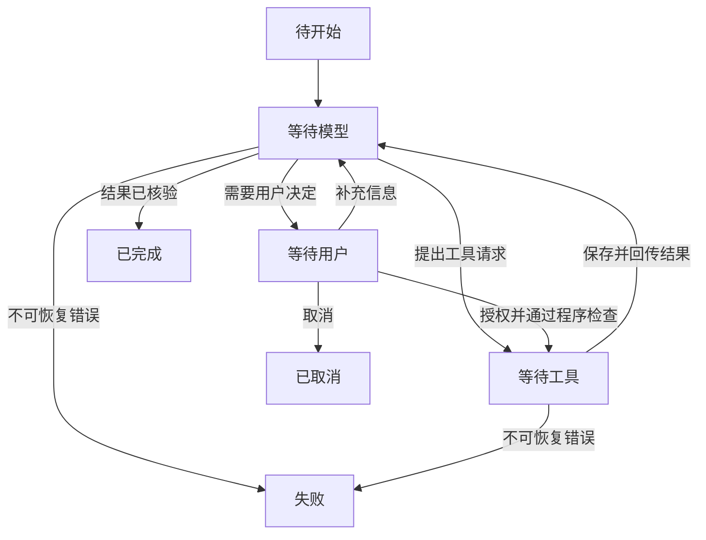

## 第四章　Agent 的行动循环

查询天气可能只需一次工具调用；修改一个网页可能要定位文件、读取、编辑、检查，再根据检查结果修正。模型本身不会自动完成这串动作。运行框架必须在每一步之后保存状态、观察结果，并决定是否继续发起下一次模型请求。

### 4.1 最小循环长什么样

下面是与任何具体 API 无关的伪代码。它省略了网络库和存储实现，但保留了控制流程：

~~~text
接收用户目标
创建任务状态：运行中，已执行步骤数为 0

当任务仍在运行中：
    如果用户取消、时间超限或步骤数达到上限：
        记录结束原因，停止

    从会话、工具清单和相关资料构造本次模型输入
    请求模型

    如果请求失败或模型输出不完整：
        按错误类型恢复或结束

    如果模型提出工具调用：
        逐条验证工具名、参数和权限
        执行允许的工具，记录每条结果
        将结果放入下一次模型输入
        已执行步骤数加一
        继续循环

    如果模型给出最终回答：
        检查是否有待处理操作及必要的完成证据
        保存回答与结束原因
        停止
~~~

这个循环说明一个重要事实：模型生成工具请求后，框架要把工具结果带回下一轮。少了这一轮，模型可能永远不知道查询成功还是失败。真实系统还要处理模型一次请求多个工具、结果部分成功、人工确认等情况。

### 4.2 用任务状态避免“似乎完成了”

可以把一次任务想成状态机：

**图 4-1　Agent 任务的主要状态转换（示意）**

任一步都可能因取消或预算耗尽而结束；图只列出主要路径。状态机不一定要写成专门的库，但运行框架应清楚记录当前阶段。至少要知道：用户目标、已调用的工具、待处理的调用、已得到的结果、累计步骤、时间预算和最终结束原因。

例如修改文件时，write_file 已发出而工具仍在执行。此时模型提前生成“已修改”的文字，不应让任务直接进入“已完成”。运行框架需要等工具返回，并在必要时读取文件检查。相反，用户在等待期间取消了任务，框架要决定能否停止尚未开始的操作，以及如何报告已经发生的副作用。

### 4.3 观察结果会改变下一步

“判断—行动—观察—调整”是理解 Agent 的简明方式。ReAct 研究把推理和行动交替组织起来：模型提出动作，环境给出观察，模型再继续。[ReAct 论文](https://arxiv.org/abs/2210.03629) 这里的“判断”指系统根据可见信息决定下一步，不要求产品展示模型完整的内部推理文本。

以天气问题为例：

1. 用户问“台北现在会下雨吗”；模型发现缺少实时资料。
2. 模型请求 get_weather("台北")；框架验证并调用工具。
3. 工具返回“超时”；框架把失败状态交回模型，而不是编造天气。
4. 模型可以请求有限重试、改用另一个允许的数据源，或说明无法确认。

同样的初始计划，因第三步的结果不同，会走向不同结局。计划因此是当前假设，不是对未来步骤的承诺。第七章会比较先规划与逐步选择工具的架构。

### 4.4 什么时候该停

Agent 不应只因为模型写了“完成”就停止，也不能无限继续。运行框架要同时管理几类结束条件：

| 结束情形 | 应如何判断 |
|---|---|
| 目标完成 | 工具结果或外部状态提供了足够证据，且没有待执行操作 |
| 信息不足 | 必要资料缺失，允许的查询方法已用尽或不值得继续 |
| 权限不足 | 所需操作未获授权，等待用户决定或结束 |
| 用户取消 | 停止尚可停止的步骤，记录已发生的动作 |
| 时间、费用或次数到上限 | 结束并报告已完成与未完成部分 |
| 不可恢复错误 | 记录错误位置和原因，避免无限重试 |

“足够证据”依任务而变。回答天气，可检查数据地点和时间；修改文件，应检查文件内容或页面结果；发送消息，要看外部服务是否确认发送。运行框架很难靠单一规则判断所有业务任务，但至少能保证没有未完成调用、未处理错误或超出预算的动作。

### 4.5 循环预算和重复请求

每轮模型请求、工具调用都可能消耗时间和费用。一个小任务可以设定最大模型轮数、最大工具调用数、总运行时间和输出长度。达到限制时，不应悄悄丢掉任务；要告诉用户目前得到什么、还有什么没完成。

模型也可能连续三次请求相同天气工具，参数和结果都没有变化。框架可以识别这种重复，交回“相同结果已取得”的状态，或停止并说明陷入循环。不过，相同工具调用不一定总是错误：用户要求每隔十分钟监测天气时，重复查询有明确目的。是否阻止，要看任务目标与时间条件。

### 4.6 何时把控制权交还给用户

有些任务缺少关键输入，例如“修改那个页面”却不知道哪个文件；有些动作风险较高，例如删除文件或购买商品。框架可以暂停在“等待用户”状态，把具体问题或待执行操作展示出来。用户回答后，任务继续使用原来的状态；用户拒绝或取消后，任务结束并记录原因。

不要把“请确认”做成一句抽象提示。有效的确认应说明将操作哪个目标、改变什么、可能有什么影响。对修改文件，展示路径与差异；对发送消息，展示收件人和内容。第九章会从权限和不可信输入角度继续讨论。

### 4.7 长任务需要可恢复的记录

如果程序在修改三个文件中的第二个时重启，只有对话摘要通常不足以安全恢复。框架需要记录哪些操作已执行、哪些尚未执行、每个结果是什么，以及是否存在不确定的副作用。恢复时先核对外部状态，再决定下一步，避免把同一次写操作重复执行。

这类记录可以是数据库中的任务行，也可以是简单系统里的文件。重要的是明确“任务状态”和“模型上下文”不是一回事：前者由程序可靠保存，后者是本次请求选择给模型看的内容。第五章将进一步讲上下文如何选择；第八章将讲错误、重试和幂等处理。

### 4.8 模型的分析文字不能代替任务状态

第一章区分了可见分析与实际证据，第三章区分了普通文本与工具调用。本章把它们放进循环：框架收到一轮模型返回时，先判断它是最终回答、工具请求、不完整输出还是错误，再更新**程序保存的状态**。若模型在文字里写“第一步已完成，下一步查天气”，却没有真正发出工具请求，程序不能把天气查询记为已完成。

一个文件任务可用以下状态表防止“说完等于做完”：

| 当前状态 | 收到的事件 | 允许转到哪里 | 不应发生什么 |
|---|---|---|---|
| 待定位 | 模型提出搜索请求 | 搜索中 | 直接报告已修改 |
| 搜索中 | 工具返回候选路径 | 待读取或待澄清 | 把候选当成已确认文件 |
| 待编辑 | 合法且获授权的编辑请求 | 编辑中 | 从自然语言“我会编辑”触发写入 |
| 编辑中 | 工具返回成功 | 待核验 | 仅凭成功字段结束任务 |
| 待核验 | 差异与目标状态符合 | 已完成 | 忽略剩余待执行调用 |

如果使用支持内部推理或推理摘要的模型，框架仍只根据接口事件、工具结果和外部状态推进。内部推理可能帮助模型选下一步；它不是写文件的提交记录，也不是天气服务的原始数据。这样设计使你以后更换模型或 API 时，任务状态仍有稳定的判断依据。

### 4.9 把一项任务真正走完

把“修改正式网页标题”当成一次状态机演练。用户消息进来时，状态不是“待回答”，而是“待定位”。模型请求搜索，程序收到两个候选页面；此时不能让模型直接选第一个并写入，应先读取候选文件的页面标题、所在目录和项目说明，必要时让用户确认。确认后保存目标路径、读取时的版本和“只改标题”的约束。

接着模型提出编辑请求，框架检查路径、编辑范围和版本，再交给文件工具。工具返回成功时，状态从“编辑中”转到“待核验”，而不是“已完成”。核验程序重新读取文件，检查新标题、旧正文和差异范围。如果旧正文被误删，状态应进入“需修复”或“部分完成”，允许在预算内提交补丁；若无法安全修复，就把具体差异交给用户。

| 轮次 | 模型可建议什么 | 程序必须保存的证据 | 可能的分支 |
|---|---|---|---|
| 搜索后 | 读取哪个候选 | 候选路径与搜索范围 | 同名文件多个时澄清 |
| 读取后 | 提出局部补丁 | 原文、版本、用户约束 | 内容已变化时重新读取 |
| 编辑后 | 解释结果或请求检查 | 工具状态、实际差异 | 写入成功但目标未达成 |
| 核验后 | 给用户报告 | 目标状态、检查范围 | 完成、部分完成或失败 |

这张表还说明“轮数”与“步骤”不总是一一对应：一次模型返回可能提出多个互不依赖的读取；一次工具调用也可能等待很久。框架要以实际事件推进状态，并保存足够信息供重启后恢复。用户中途说“算了，别改”，框架应停止未开始的写入；如果文件已经写入，就报告已发生的修改，不能把取消解释成自动回滚。

### 本章小结

- Agent 的多步能力来自“模型请求—工具执行—结果回传”的循环。
- 任务状态记录当前阶段、已发生的操作和结束原因。
- 停止条件既要检查模型输出，也要检查工具结果、外部状态和运行预算。
- 工具失败会改变下一步；不完整任务应明确报告。
- 需要用户判断时，运行框架暂停并展示具体待执行动作。
- 可见分析和推理摘要不更新外部状态；状态转换应依据完整接口事件与真实工具结果。

### 想一想

1. 文件写入工具还未返回，模型已输出“修改完成”。任务应该进入“已完成”吗？
2. 用户取消任务时，前两次文件修改已经成功。最终报告至少应包含什么？
3. 连续请求同一个天气工具三次，什么情况下是循环错误，什么情况下是合理行为？
