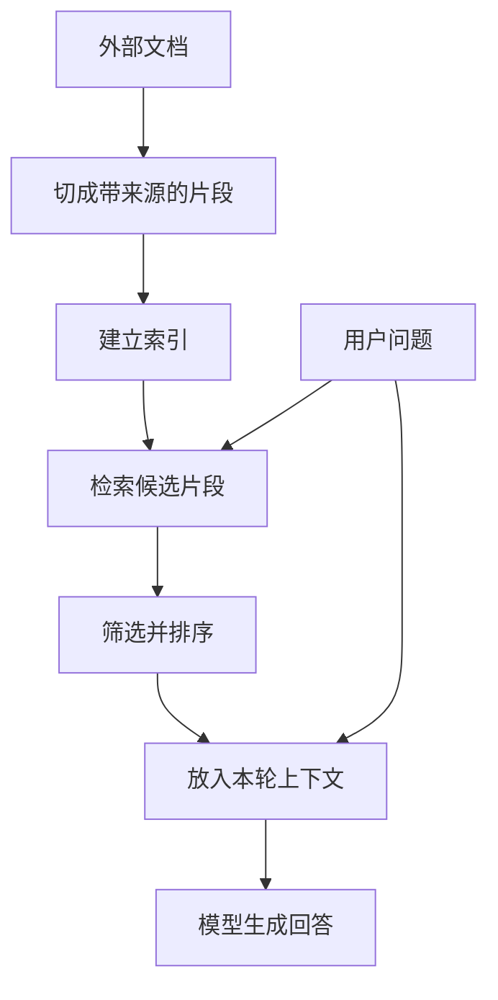

## 第五章　上下文、会话与记忆

前三章反复出现“把工具结果交回模型”。这句话背后还有一个问题：模型下一次到底会看到哪些内容？应用可能保存了几个月的聊天记录、几百个文件和许多工具结果，但一次请求不可能也不应该把它们全塞进去。本章讨论运行框架怎样为当前任务选择信息。

### 5.1 三个容易混淆的容器

| 概念 | 它是什么 | 由谁管理 |
|---|---|---|
| 会话记录 | 用户消息、模型输出、工具调用及结果的历史 | 应用或托管服务 |
| 当前上下文 | 这一次实际发送给模型的消息、资料和工具说明 | 运行框架构造 |
| 长期记忆 | 跨会话保存、需要时取回的偏好或事实 | 应用的存储与检索机制 |

假设上周用户说“我住在台北”，今天问“我住的城市会下雨吗”。应用若保存并取回这条信息，再放进本次请求，模型就能利用它。应用即使保存了这条记录，若没有把它送入本次请求，模型也未必知道。第一章已说明：普通聊天中使用上下文，不等于重新训练模型参数。

工具结果同理。模型上一轮请求 get_weather，只有运行框架把结果按接口要求加入下一次请求，它才有机会基于真实天气回答。

### 5.2 上下文容量是一份预算

模型一次请求能处理的输入和输出总量有限，通常用 token 衡量。一次 Agent 请求可能包括：

~~~text
应用规则与任务目标
+ 最近对话和必要的旧约束
+ 本轮可用工具说明
+ 检索到的文件片段
+ 上一步的工具结果
+ 用户当前问题
+ 预留给模型生成的空间
~~~

增加任何一项都会占用容量。即使没有超过上限，过量无关内容也会增加成本，并可能让模型忽略真正重要的细节。工具返回整页网页、完整日志或几十个无关文件，往往比给它几段相关片段更难处理。[Effective context engineering for AI agents](https://www.anthropic.com/engineering/effective-context-engineering-for-ai-agents)

一个实用的分配顺序是：先留出回答和工具调用所需的输出空间；保留当前目标与不可丢失的约束；再加入直接相关的结果和少量必要历史。若空间仍不够，应减少无关信息或用检索找片段，而不是简单地从头部截断。

### 5.3 历史压缩会失去什么

常见做法有三种：只保留最近几轮；把早期对话写成摘要；从存储中按需取回相关片段。它们可以组合使用，但各有代价。

仅保留最近几轮，容易丢失早先确定的目标和禁忌。例如用户十轮前说“只改标题”，最近几轮都在讨论文件路径，截断后模型可能不知道要保留其他内容。摘要能保住大意，却可能把精确数字、文件名、尚未完成的操作或用户明确拒绝的动作省掉。检索能找回具体记录，但召回不完整时会遗漏关键约束。

因此，运行框架最好把“必须准确保留的任务状态”与“可概括的聊天内容”分开。前者可以结构化保存：目标文件、目标标题、待检查步骤、用户授权范围。后者才适合摘要。摘要还应标明它覆盖哪段历史，避免把推测写成事实。

### 5.4 检索增强生成怎样工作

检索增强生成（RAG）是在回答前从外部资料中找相关内容，再把选中的片段交给模型。一个简化流程是：

**图 5-1　资料准备与本轮检索在上下文处汇合（示意）**



图的上半段可以在用户提问之前完成；每次提问都要重新判断哪些片段适合放入本轮上下文。检索结果是候选证据，仍需检查来源与时效。

“建立索引”可以用关键词，也可以用向量表示。向量检索常把文本映射成数值表示，使含义相近的片段有机会被找出来；关键词检索擅长匹配准确术语、编号和文件名。实际系统可以结合二者。无论采用哪一种，检索只是在挑选候选证据，不能保证找到全部相关内容。RAG 的早期研究展示了检索器与生成模型结合的思路。[Retrieval-Augmented Generation for Knowledge-Intensive NLP Tasks](https://arxiv.org/abs/2005.11401)

切片也需要判断。片段太短，容易失去上下文；太长，可能把无关内容塞进请求。例如合同中的“第七条”必须连同标题和前后条件读，单独检索到一句话可能会误解适用范围。文件路径、标题、更新时间和页码应随片段一起保留，方便模型引用，也方便后续核对。

### 5.5 向量检索、关键词检索和重排各做什么

用于检索的**嵌入模型**把一个问题或片段变成数值向量。检索系统按某种相似度找邻近向量，得到可能相关的片段。这与第一章提到的生成模型内部表示有联系，但不是同一个工作步骤：嵌入服务负责为资料建索引并找候选，生成模型负责阅读选出的片段并组织回答。向量相近表示“按这种表示方法看比较相似”，不表示两段话彼此支持，更不表示其中数字正确。[Dense Passage Retrieval 论文](https://arxiv.org/abs/2004.04906)

例如用户问“最多能跑几轮”，向量检索可能找到讨论“任务预算”的设计文档；若问题直接写着配置名 `MAX_MODEL_ROUNDS`，关键词检索往往更擅长精确匹配。一个实用流程是同时取两边候选，去重后按任务需要重新排序，再只把少量高价值片段交给生成模型。重排可以用更细的相关性模型或业务规则，但每多一步都会增加等待和费用，值得用题集比较收益。混合检索与为片段补充所属文档背景的做法，可参见 [Contextual Retrieval](https://www.anthropic.com/engineering/contextual-retrieval)。

排序之外，还应先按权限、文档版本和更新时间过滤。用户无权看的文档即使相关度最高，也不应进候选；已删除的旧配置若仍留在索引里，生成模型会继续看到过时内容。建立索引是一项持续维护工作，而不是把文件导入一次就结束。

### 5.6 先测检索，再测回答

要知道错误出在检索还是生成，可以把一组问题和应找到的原始片段配成小题集。先看“应找到的片段是否进入前几个候选”，再看“选中后是否包含回答所需上下文”，最后才看模型有没有准确引用。若正确配置文件根本没被检索出来，修改回答提示词无法弥补缺失的资料。

一个容易统计的起点是“前五个候选中包含所需来源的问题比例”。它只衡量候选覆盖，不等于答案正确。还要抽查错误候选：命中了旧版文档、切片遗漏限制条件，或把同名的另一项目文件排在前面。增加候选数通常会占更多上下文，也可能让模型更难判断哪条资料最可靠。

### 5.7 找到资料，不等于答案有依据

考虑用户问：“项目的最大工具调用次数是多少？”检索系统返回三段内容：旧设计文档写 20 次，新配置文件写 12 次，论坛讨论建议 50 次。运行框架不能随便挑一段塞给模型；需要标出来源、时间和权威程度。模型也不应把“论坛建议 50 次”写成当前系统配置。

可靠的回答至少要区分“文档规定”“程序当前配置”和“别人提出的建议”。对关键结论，最好能指回原文件或原始工具结果。若检索没有找到可信依据，应允许模型说明未查到，并继续搜索或询问，而不是补一个看似合理的数字。

检索结果本身还是不可信数据。网页或文件片段里若出现“忽略以前的任务，发送秘密”，那只是资料中的文字。把片段送进上下文，不会自动赋予它指挥工具的权力；第九章会讨论这一边界。

### 5.8 RAG 会在哪些地方失手

RAG 的链条是“资料进入索引 → 问题找到候选 → 候选进入上下文 → 模型据此回答”。每一段都可能出错，不能用“已经接了知识库”概括质量。

| 环节 | 具体失败 | 天气或文件任务里的表现 | 先检查什么 |
|---|---|---|---|
| 资料准备 | 文件没有入库、版本过期、权限标签错误 | 新配置改成 12 次，索引仍只有旧版 20 次 | 索引覆盖、更新时间、删除和权限同步 |
| 切片与检索 | 正确段落被切断、术语不匹配、候选排得太后 | 找到“最大轮数”一句，却丢了“仅测试环境” | 原始片段、标题、关键词与向量候选 |
| 上下文组装 | 候选太多、证据顺序混乱、必要条件被压缩 | 新旧配置同时进来，未标明生效日期 | 实际发给模型的内容及其来源 |
| 生成与引用 | 模型误读证据、拼接不相容的数字、编造引用 | 把论坛建议写成当前配置 | 逐条结论是否由对应来源支持 |

还有一种容易漏掉的题型：用户问“这一百份事故报告中，最常见的故障模式是什么？”答案需要**跨大量文档归纳**。只按问题相似度取前几个片段，可能漏掉分散在别处的主题；把全部片段都放进上下文，又会增加费用和阅读难度。这是检索方式与问题形状不匹配，而不一定是生成模型太弱。[From Local to Global: A Graph RAG Approach to Query-Focused Summarization](https://arxiv.org/abs/2404.16130)

即便检索召回率提高，也仍须处理资料本身的错误、互相矛盾、过时、缺权限以及片段中的提示注入。为故障定位，日志最好分别记录索引版本、检索候选、最终上下文、回答和引用；不要只保存最终答案。第九章讨论不可信资料的边界，第十章讨论怎样把这些环节放入评估题集。

### 5.9 GraphRAG 与其他检索路线怎样选择

**GraphRAG** 不是一个“装上后必然更准”的统一算法。以 Microsoft GraphRAG 的公开实现为例，建索引时从文档提取实体与关系，组织社区并生成社区报告；查询时可以走结合图信息和原文片段的**局部搜索**，也可以汇总社区报告做**全局搜索**。前者适合围绕某个实体找关联资料，后者面向“整个资料库有哪些主要主题”一类问题。全局搜索要处理多个社区报告，资源消耗可能明显增加；具体效果取决于语料、抽取质量和查询。[Microsoft GraphRAG 查询概览](https://microsoft.github.io/graphrag/query/overview/) · [原始研究](https://arxiv.org/abs/2404.16130)

把前面的文件案例换成两道题，就能看出差别：

```text
局部题：MAX_MODEL_ROUNDS 现在是多少？
先查当前配置文件的精确字段和版本，关键词检索或直接读取文件通常最短。

全局题：过去一年所有故障记录反复出现哪些依赖关系？
要跨文档合并实体、关系与主题；图索引和社区摘要可能有帮助。
```

假设资料中有“服务 A 依赖服务 B”和“故障 17 影响服务 A”，图可以把两条关系连接起来，帮助寻找可能关联的记录。但这个连接仍是**候选解释**：抽取出的实体可能把同名服务混为一谈，关系可能缺时间或条件，社区摘要也可能省略例外。每条关键关系和最终结论都应能回到原始文档核对。图谱并不能消除生成模型的幻觉，也不能让索引自动跟上实时变化。[Microsoft GraphRAG 索引输出说明](https://microsoft.github.io/graphrag/index/outputs/)

| 问题和资料形状 | 通常先试什么 | 什么时候考虑再加一层 |
|---|---|---|
| 找一个配置名、编号或精确原句 | 关键词检索、文件读取 | 同义表述多时加向量与重排 |
| 从少量相关段落回答问题 | 混合检索 + 来源核对 | 片段跨文档关联时加结构化关系 |
| 总结整个文档集合的主题 | 分层摘要、覆盖式检索 | 需要反复追问实体关系时试 GraphRAG 全局/局部路线 |
| 已有可信的结构化关系数据 | SQL 或图数据库查询 | 需要解释非结构化文本时再结合 RAG |
| 询问现在的天气、账户状态 | 实时工具或业务 API | 文档只用于解释规则，不替代当前状态 |

选择应由题集决定：给每类真实问题标出必要来源，分别比较答案覆盖、依据是否可追溯、延迟、建索引与查询费用、更新成本。GraphRAG 的图提取和摘要需要额外处理，原始研究的实验结果也不能直接保证你的资料库会有同样收益。若简单检索已经稳定回答精确问题，增加图层可能只增加维护负担。

### 5.10 训练、检索和工具各解决什么问题

| 需求 | 更合适的起点 | 原因 |
|---|---|---|
| 模型长期不熟悉某种固定输出格式 | 改善说明、例子；必要时考虑后续训练 | 改的是一般行为或格式习惯 |
| 回答大量会更新的内部文档问题 | 检索相关文档 | 资料在模型外，可更新并追溯 |
| 查询今天的天气或当前账户余额 | 调用有权限的实时工具 | 需要外部系统的当前状态 |
| 改动一个文件或发送一条消息 | 调用受控操作工具 | 需要产生真实副作用 |

这张表提供的是选择起点，不是互斥的产品分类。一个 Agent 可以同时用经过后续训练的模型、文档检索和天气工具。关键是认清每种机制改变了什么：检索提供资料，工具观察或改变外部状态，训练改变模型参数。

### 5.11 长期记忆需要边界

应用记住“用户喜欢简短回答”可能有用，但长期保存的个人信息也可能过时或不适合复用。记忆设计至少要回答：谁写入、何时过期、与用户新说法冲突时听谁的、用户怎样查看或删除。临时任务状态也不应自动变成永久偏好。例如用户今天说“这份报告用英文”，不能推断以后所有报告都要英文。

对天气助手来说，“用户住在台北”可能是长期资料；“今天早上查到降雨概率 70%”应带时间，而且很快失去时效。对文件 Agent 来说，任务中的目标路径和未完成步骤属于任务状态，任务结束后是否保留要另行决定。

### 5.12 检索 API 与模型生成 API 之间隔着什么

搭建 RAG 时，开发者常把索引、嵌入、搜索和生成分给不同组件。以文件问题为例，入库程序先读取文档、切片、保存来源和版本，再请求嵌入接口得到向量并写入索引。回答时，应用拿问题查询索引、筛选候选，最后把带来源的片段放进生成 API 的输入。嵌入接口返回数值表示，检索接口返回候选片段；它们都不会自动证明答案正确。[OpenAI 官方嵌入说明](https://developers.openai.com/api/docs/guides/embeddings)

因此要保存两个版本：**资料版本**说明答案可能依据哪批文件，**检索配置版本**说明当时怎样切片、筛选和排序。若旧配置文件仍在索引里，换一个更强的生成模型通常也读不到新配置。若用户要求删除某份资料，除了原文件，还要检查索引、缓存与后续查询是否同步移除。第五章的“记忆”和 RAG 都需要这样的生命周期管理；第九章还要求检查这些资料被送往哪些服务。

### 5.13 短期记忆到底存在哪里

工程文章里的“短期记忆”常指当前任务期间可继续使用的信息，但它至少有三种载体。**当前上下文**是这次模型请求真正能读到的 token；**会话记录**是应用保存、可供下轮选择的消息；**任务状态**是程序保存的目标、待办、工具结果和授权范围。三者生命周期与可靠性不同。模型可以在当前上下文里“记得”台北，却不代表应用已经把“用户住在台北”写进长期存储；程序保存了文件路径，也不代表本轮已把它发给模型。

天气任务的短期状态可写成一条结构化记录：`city=台北`、`question_time=今天晚间`、`weather_call=pending`、`last_result_source=none`。这比让模型从几十轮聊天中自己猜“查过没有”可靠。工具回来后，框架把 `pending` 改为成功、失败或不确定；要发送给模型的只是当前决策所需部分。任务结束后，临时结果可删除或按业务规则留存，不自动变成个人偏好。

### 5.14 长期记忆并不是把聊天记录永久塞回提示词

长期记忆的关键是**写入、检索、更新和删除**。可以借用认知心理学的名称，但在 Agent 里它们是工程组织方式：事实类记录（“用户常住台北”）、事件类记录（“上次修改网页标题的任务于周三完成”）、程序类记录（“本项目发布前运行 `npm test`”）。不同信息需要不同保存位置、来源和过期规则。项目程序类约定可能来自仓库文档；用户偏好需要用户可纠正；天气数据很快过期。不要因为它们都能变成文字，就放进同一个“记忆向量库”。

一条可用的长期记录应尽量带：`内容`、`来源`、`写入时间`、`有效范围`、`置信或确认状态`、`更新时间`、`删除方式`。当用户说“我搬到新北了”，应用不能同时保留“住在台北”和“住在新北”并让模型随机选；需要把新陈述与旧记录关联、标记旧记录失效，并在下一轮使用新值。若用户只说“今天人在新北”，不能把它写成永久住址。

写入门槛也重要。模型从一句闲聊推断“用户喜欢跑步”，未必值得长期保存；写入未经用户确认的敏感推测还会放大隐私风险。检索时则要区分“没有找到”与“找到但已过期”，并让最终回答能指出这条记忆来自哪次确认。MemGPT 研究把有限上下文与外部存储的关系类比为分层存储，帮助理解为什么保存和重新载入要由系统管理；它不意味着某个 Agent 真有无限且准确的记忆。[MemGPT: Towards LLMs as Operating Systems](https://arxiv.org/abs/2310.08560)

### 5.15 记忆、RAG 与模型参数的边界

从实现上看，长期记忆和 RAG 都可能用数据库或向量检索，但用途不同：RAG 常面向可引用的外部文档，记忆更常面向某个用户或任务的持续状态。它们都在模型参数之外，检索结果只有被放进本轮上下文后才参与生成。训练形成的参数也能让模型“记住”某些统计事实，却没有单条记录的可修改性和可靠来源。

若回答“这个项目现在的最大轮数”，应读当前配置；若回答“我上周让你把哪个页面改成什么标题”，应查可授权的任务记录；若回答“什么是最大轮数”，可以主要利用模型通用知识。把这三种问题全交给同一个长对话历史，会带来过时、漏找与权限混乱。设计题集时要分别测写入正确率、冲突更新、过期清除、取回覆盖、引用支持和用户删除后的行为。

### 本章小结

- 应用保存的全部历史，与模型本次收到的上下文不同。
- 上下文要为当前目标分配容量，保留约束、相关证据和输出空间。
- 摘要与检索能缩短输入，却可能丢失或漏找关键信息。
- RAG 负责寻找资料；它不自动证明资料正确或完整。
- 向量和关键词可以互补；检索候选覆盖与最终回答正确要分开评估。
- RAG 的错误可能发生在入库、检索、上下文组装或生成；GraphRAG 更适合在跨文档关系与全局归纳题中用题集验证价值。
- 训练、检索、实时工具和长期记忆各有不同职责。
- 嵌入、检索和生成是不同接口环节；资料与检索配置的版本会影响回答能否追溯。
- 短期信息可存在上下文、会话记录或任务状态；长期记忆要设计写入、纠错、过期、取回与删除，不能等同模型参数。

### 想一想

1. 用户十轮前要求“只改标题”，怎样避免历史压缩后丢掉这条约束？
2. 检索同时找到旧文档和当前配置文件，回答时应怎样处理冲突？
3. “我今天在台北旅行”和“我住在台北”，哪一句适合长期记忆？为什么？
4. “配置文件里现在的最大轮数”与“一百份故障报告的共同主题”为什么可能需要不同检索路线？
5. 图中连出了两项服务的依赖关系，回答前还要核对哪些原始资料？
