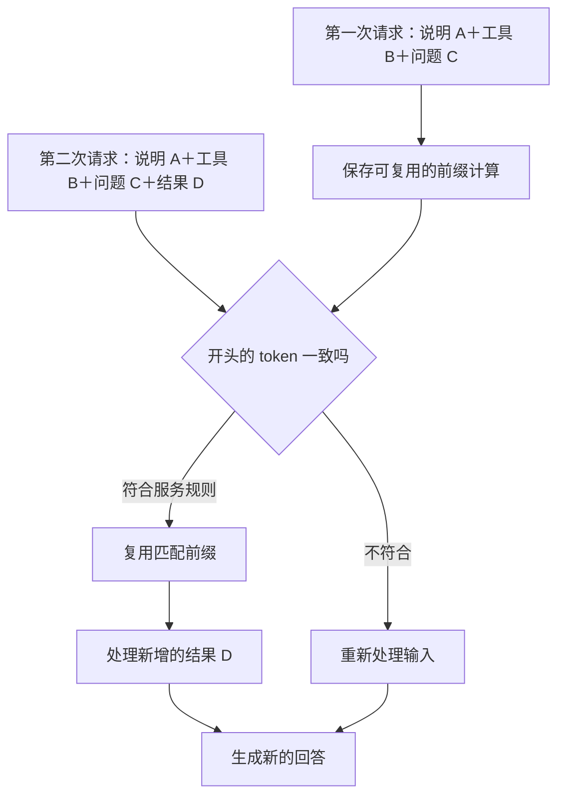

## 第六章　生成时的计算与两种缓存

第五章讨论“模型这次看什么”，本章讨论“模型处理这些内容要付出多少计算”。同一个 Agent 反复发送相似的应用说明、工具定义和会话前缀，服务端可能复用部分计算；但“缓存命中”不等于模型已经记住事实，更不等于本次答案不用生成。

### 6.1 从请求到回答的两个阶段

一个简化视角把生成分成两段：

1. **输入处理（prefill）**：模型读取本次已有的 token，计算后续生成要用的内部状态。
2. **逐步生成（decode）**：模型一次选择一个新 token，并继续为下一个位置计算。

假设请求包含几千 token 的固定说明和文件片段，回答只有几十 token，输入处理可能占相当一部分等待时间。若输入很短而回答很长，逐步生成可能成为主要部分。真实延迟还包括网络、排队、工具调用和结果传输，因此不能只凭“输入长度”预测总时间。

模型服务常记录输入 token 与输出 token；应用还应分别记录模型等待、工具等待和总任务时间。这样优化时才知道慢在何处：更短的上下文、并行独立工具调用、减少重复模型请求，或缓存，针对的是不同问题。

### 6.2 一次生成中的 KV cache

Transformer 的注意力计算会用到 Query、Key、Value 等内部表示。模型逐步生成第 100 个 token 时，前面位置的 Key 和 Value 可以保存在内存里，后续步骤使用这些状态，避免每生成一个新 token 都把之前的位置完整重算。

这通常称为 **KV cache**。它帮助同一次生成向后推进，但也占用显存或内存。上下文越长、并发请求越多，缓存管理越重要。具体内存规模取决于模型架构、精度和推理引擎，不能用一个固定数值概括。[Hugging Face Transformers：KV cache 解释](https://huggingface.co/docs/transformers/cache_explanation)

KV cache 是推理内部的计算状态；它不是用户可搜索的长期记忆，也不保存“上次回答的事实”供模型下次直接取用。不同服务可能利用类似状态支持跨请求复用，但那需要额外的缓存策略和命中规则。

### 6.3 跨请求的前缀缓存

很多 Agent 请求都从相同的应用说明、工具定义开始。若服务保存了一个可复用的输入前缀，下一次请求从开头包含完全相同的 token 前缀时，就可能跳过其中一部分重复输入处理。这类功能常叫上下文缓存或提示词前缀缓存。

例如：

**图 6-1　第二次请求复用相同开头，仍处理新增内容（示意）**

第二次从开头重复了 A、B、C，可能命中已保存前缀。服务仍须处理新加入的 D，并重新生成第二次回答。如果第二次把用户问题 C 改写，或在最前面插入变化的时间戳，最长的可复用前缀可能缩短。DeepSeek 的文档以命中和未命中的输入 token 数展示这类缓存；具体命中仍取决于服务规则。[DeepSeek 上下文缓存文档](https://api-docs.deepseek.com/zh-cn/guides/kv_cache/)

应区分**完全匹配的前缀**与**语义相似的资料**。RAG 检索可能找出意思相近的段落；前缀缓存通常需要从请求开头开始满足服务的精确匹配条件。相同文档若被放到不同开头之后，不一定能复用同一段缓存。

### 6.4 两种缓存和答案缓存

| 机制 | 复用什么 | 常见收益 | 不会做什么 |
|---|---|---|---|
| 生成中的 KV cache | 本次生成已处理位置的内部状态 | 减少后续 token 生成的重复计算 | 不让模型跨会话记住用户资料 |
| 跨请求前缀缓存 | 符合规则的重复输入前缀计算 | 减少重复输入处理，某些服务也降低相应费用 | 不直接复用上次完整答案 |
| 答案缓存 | 之前生成的完整响应 | 在适用时直接返回旧答案 | 不适合未经检查地回答实时问题 |

前两种机制可能在底层技术上相关，但它们面对的问题不同：一个伴随当前生成，另一个跨请求判断是否复用。答案缓存则更接近普通软件缓存：若键与策略允许，直接拿旧响应。对“台北现在下雨吗”，旧答案很快失效；若没有明确时效规则，答案缓存会把过去当成现在。

### 6.5 命中后还要做哪些工作

即使命中长前缀，服务器通常仍要查找和读取缓存、处理新增输入、为新回答逐步生成 token，并维护缓存存储。它并没有“免费回答”。

收益要按具体任务看。固定说明很长、变化部分很短、回答也短时，前缀缓存可能明显；固定说明很短、回答很长时，节省的输入处理占比可能很小。不同服务的缓存计费、保留时间和命中粒度也不同，部署前要查当前文档并用真实请求测量。

对应用而言，值得记录的不是一个孤立的“命中率”，还包括每次请求的输入 token、命中 token、未命中 token、输出 token、首字等待时间和总延迟。高命中率若伴随多次无用模型调用，整个任务仍可能昂贵而缓慢。

### 6.6 算整项任务，而不是只算一次请求

假设天气 Agent 为同一问题连续请求模型三次，每次输入 2,000 token，输出 200 token。按请求数相加，整项任务共发送了 6,000 个输入 token、生成了 600 个输出 token；若后两次各有 1,500 个输入 token 命中前缀缓存，就要把“命中输入”“未命中输入”和“输出”分开计量。不同服务的计费规则会变，不能把命中 token 当成完全免费。[DeepSeek 上下文缓存文档](https://api-docs.deepseek.com/zh-cn/guides/kv_cache/)

任务耗时还包含模型服务排队、输入处理、逐步生成、天气 API 等工具等待，以及程序自己的验证与传输时间。串行步骤大致相加；彼此独立且同时运行的步骤才可能缩短等待。流式显示让用户较早看到文字，但不保证工具调用或整项任务更早完成。

因此优化要先找瓶颈：如果时间主要花在天气 API 超时，调整前缀位置帮助很小；如果十轮模型请求中有三轮只是重复相同工具结果，减少无用往返可能比提高缓存命中率更有效。比较方案时记录同一题集的任务完成率、总时间、模型调用数、token 用量和外部工具费用，再决定是否值得改变结构。

### 6.7 怎样组织请求才容易复用

若业务确实重复使用同一段内容，可以把稳定的应用说明和工具定义放在较稳定的请求前部，把本轮日期、用户问题和检索结果放在后面。不要为了缓存而把不相关的长文档永久塞在前面：它既占容量，也可能干扰模型选择正确资料。

维护缓存也有成本。工具定义更新、权限变化和说明修订可能让前缀改变；这时准确性与安全性优先于命中率。若某个工具已被撤销，不能为了复用旧前缀继续把它暴露给模型。

### 6.8 回到天气与文件任务

天气助手有一段稳定说明和天气工具定义。连续两轮对话可能复用这部分前缀，但每次实时天气结果仍须重新查询和处理。前缀缓存不会把今天的天气“写进模型”。

文件 Agent 刚读取了一个大文件，又根据用户要求修改标题。下一轮可能复用前面的稳定输入，但必须加入新的文件读取结果、修改结果和核对信息。若文件已变化，继续复用旧内容作为事实依据会误导模型。缓存可优化计算，不能代替检查外部状态。

### 本章小结

- 输入处理和逐步生成是不同的计算阶段。
- KV cache 帮助一次生成继续向后；前缀缓存有条件地跨请求复用重复输入。
- 缓存命中省掉部分重复计算，新输入和新答案仍需处理。
- RAG、前缀缓存和完整答案缓存解决不同问题。
- 优化应看整个任务的时间、费用和正确性，而不只看命中率。
- 流式、缓存和减少模型往返改善的是不同环节，需按整项任务计量。

### 想一想

1. 把每次变化的时间戳放在请求最前面，可能怎样影响前缀缓存？
2. 一次请求命中 90% 的输入 token，为什么总耗时仍可能很长？
3. 天气助手能否用昨天生成的完整回答直接回答“现在”的天气？
