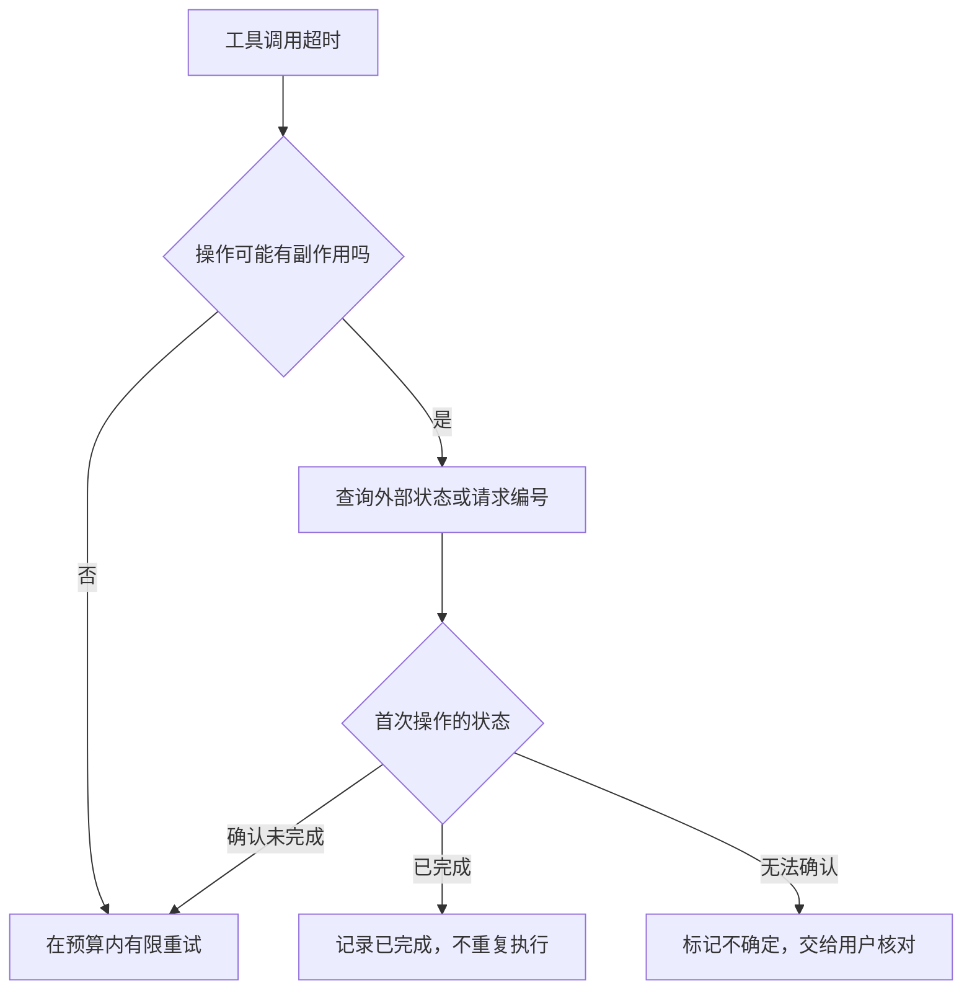

## 第八章　可靠性：失败时系统怎么表现

一个 Agent 在演示里查到天气，不代表它能稳妥处理服务超时、城市名称模糊、旧数据和模型误读。可靠性不只是“成功率高”，还包括失败时知道哪里坏了、哪些动作已经发生，以及怎样安全地继续或停止。

### 8.1 把失败定位到具体环节

同一句“查询失败”，可能来自不同层：

| 环节 | 例子 | 常见处理 |
|---|---|---|
| 模型请求 | 网络中断、服务超时 | 有限重试或换用允许的服务 |
| 模型输出 | 工具名不存在、参数不完整 | 验证并把错误交回模型 |
| 权限检查 | 请求读取不允许的文件 | 拒绝操作，必要时询问用户 |
| 工具执行 | 天气服务限流、文件不存在 | 按错误类型恢复 |
| 业务结果 | 返回了昨天的数据，却要回答现在 | 重新查询或说明不足 |
| 结果使用 | 模型把新北数据写成台北 | 核对关键字段并纠正 |
| 流程控制 | 工具成功后循环没有继续 | 检查状态转换和待处理调用 |

日志和错误结果要指出发生在哪一步。只有“Agent 失败”四个字，开发者不知道该改模型说明、工具实现、权限配置还是运行框架。

### 8.2 重试要按错误类型决定

短暂网络故障可能值得重试；参数格式错误需要修正；权限拒绝通常不能靠重复调用解决。重试还应有限次数、间隔和总预算，否则一个小任务会变成漫长而昂贵的循环。

对读取型工具，重复查询通常影响较小；对修改型工具，重复可能产生两次副作用。假设模型要求发送邮件，服务端已经发送成功，但回应在网络途中丢失。运行框架看到“超时”并立即再发一次，就会造成重复邮件。正确的恢复顺序是先确认第一次操作是否完成，再决定是否重试。

系统可以给一次意图分配稳定的请求编号，由工具或外部服务据此去重。若目标服务不支持请求编号，就先查询外部状态，或把结果标为“不确定，需人工核对”。这类“重复请求不会造成重复副作用”的设计称为幂等处理。不能假定所有外部 API 都具备它。

**图 8-1　工具超时后，先判断副作用再决定是否重试（示意）**

这张图只处理“超时且可能重试”的分支。权限拒绝或参数错误应按各自原因处理，不会因为重复请求就自动变成成功。

### 8.3 工具结果要有机器能检查的形状

天气工具返回“好像要下雨”，模型仍不知道地点、时间和概率。更有用的结果是明确字段：city、observed_at、rain_probability、ok 和 error_code。读取文件工具应报告路径、文本、是否截断；运行命令应分开记录退出码、标准输出和错误输出。

结构化结果并不要求每个工具都返回同一套字段，但要能区分三种状态：**确实成功、确实失败、状态尚不确定**。把超时伪装成空列表，会让模型误以为“没有天气数据”或“文件中没有匹配项”。错误应作为信息进入下一轮，供模型调整或向用户说明。

### 8.4 给结论留下核验路径

第一章说过，模型可能生成流畅却没有依据的内容。Agent 还会出现两类不同错误：资料没有给出答案，模型自行补了细节；资料给出了答案，模型却用错了。例如工具没返回降雨概率，模型写出“70%”；或者台北结果是 30%，模型错拿新北的 70%。

因此，不能只靠“不要幻觉”的提示。工具结果要保留地点、时间和来源；运行框架要保存调用状态；最终回答中的关键数字应能对应到一条实际结果。证据不足时，回答“尚无法确认”比填一个数字更可靠。需要严格正确的场景，可以由程序直接检查结构化字段，而不只让模型自己复述。

核验强度要跟错误代价相称。普通天气建议可以注明数据时间；采购金额、医疗剂量和财务数字则需要更可靠的来源与独立复核。第十章会讨论如何把“有依据地回答”变成评估任务。

### 8.5 检查结果，而不只检查过程

文件 Agent 走过“搜索、读取、编辑”三步，仍可能改错文件。可靠的结束检查应看目标状态：标题是否成为指定文字；其他关键内容是否仍在；工具是否报告错误；差异是否超出范围。流程日志证明尝试过什么，最终状态证明任务做成了什么。

有时目标无法完全自动验证。例如用户说“让首页更好看”，程序很难用一个布尔值判定成功。这时至少可检查页面能否打开、是否出现明显错误、修改范围是否符合要求，并把主观判断交给用户。不要把“无法全自动验证”当成“无需验证”。

### 8.6 恢复、降级与报告

当主天气服务超时，若系统事先允许备用数据源，可以换源并标明来源；若没有可用服务，就给出“无法确认当前天气”。当文件不存在，模型可以搜索相邻目录；若仍找不到，应说明已查的范围并询问路径。

任务结束时，报告应覆盖：完成了什么、依据是什么、哪里失败或不确定、有没有已发生的副作用。对长任务尤其如此。用户取消了三步修改中的第二步，报告不能只说“已取消”，还应说明第一步已经写入了什么，以便用户决定是否回滚。

### 8.7 并发任务会让“刚才读到的”过期

文件 Agent 读取 `web/index.html` 后，另一个进程也可能修改它。若 Agent 用旧内容直接覆盖，原本无关的改动会丢失。可靠做法是让编辑工具接收“我读取时的版本”或原文匹配条件：版本未变才写入；版本变化则拒绝，重新读取并生成补丁。这类检查也适用于数据库记录和在线文档。

并发还会影响重复执行。两个任务同时看到“邮件尚未发送”，随后都发送一遍，仅靠各自查询外部状态无法去重。能产生副作用的工具最好由执行端维护稳定的请求编号或原子状态转换；做不到时，就要明确存在重复风险，并把不确定状态交给用户。第五章的模型上下文保存的是某个时刻的资料，不能代替外部系统当前状态。

排查这类问题需要把同一次任务的模型请求、工具调用和外部操作关联起来。每条记录至少有任务编号、步骤编号、工具请求编号、时间、结果状态和版本信息；日志里仍应避开密钥与无关个人内容。这样一个“修改失败”才能追到具体的旧版本，而不是只剩模型最后那句“我已完成”。

### 8.8 把“幻觉”拆成可修的错误

“模型幻觉了”只描述表面现象，往往不足以指导修复。同一句“台北现在降雨概率 70%”，至少可能来自四种不同故障：工具根本没调用，模型凭模式补出数字；工具查的是昨天，模型没看时间；工具查了新北，模型把地点配错；工具返回 30%，模型在转述时写成 70%。

| 失败类型 | 可观察证据 | 优先修哪里 |
|---|---|---|
| 无来源的事实 | 没有工具结果或资料片段支持数字 | 让系统允许承认未知；必要时查询 |
| 来源不适用 | 有资料，但地点、时段或版本不符 | 工具结果字段与适用性检查 |
| 错误归因 | 引用存在，却不支持对应句子 | 引用到结论的逐项核对 |
| 声称做了未做的事 | 模型说“已发送”，轨迹无发送记录 | 最终报告的动作核验 |

修复也要对应原因：改提示词不能找回没有入库的文件；增加 RAG 候选不能修复错误的实时天气 API；让模型多写思维链不能证明发送工具真的执行。高影响结论应由程序检查来源字段或外部状态，开放式解释再交给模型组织。若仍无法确认，就把不确定性留在报告里。

### 8.9 一次错误应该怎样复盘

假设天气 Agent 回答：“台北今晚降雨概率 70%，建议带伞。”用户指出天气服务给的是新北 70%、台北 30%。复盘不要先改提示词，而要沿轨迹查：用户问的是哪个城市；模型请求了哪些工具；每条请求的调用标识是什么；工具返回的地点与时间是什么；框架把哪条结果放进第二轮上下文；最终回答引用了哪条结果。

如果工具结果本身城市正确、调用标识也正确，但框架合并两条并行结果时错配，修复应在**结果关联代码**，并加入“台北与新北同时查询、返回顺序颠倒”的回归题。若框架关联正确而模型在最终转述时错拿数字，可以让程序在高价值字段上做结构化核对，或缩小第二轮上下文，让城市和概率更容易对应。若工具本身返回错城市，则应修天气服务的请求与响应检查。三种修复位置不同，评估题也不同。

复盘记录可以写成四列：**预期**（回答台北 30%）、**实际**（回答 70%）、**最早偏离点**（例如框架把新北结果放入台北调用）、**防止复发的检查**（按调用标识与城市双重校验）。若找不到最早偏离点，说明日志缺关键字段；此时先补可观察性，再宣称“已修复幻觉”没有依据。

### 本章小结

- 失败应定位到模型、参数、权限、工具、结果使用或流程控制的具体层。
- 重试必须考虑错误类型和操作是否会产生副作用。
- 结构化结果要区分成功、失败与状态不确定。
- 最终回答的关键事实和任务完成情况，都应有可核对的证据。
- 任务部分完成时，要明确报告已经发生的动作。
- 并发写入要检查版本；有副作用的操作要从执行端考虑去重。
- 将无来源事实、过时资料、错误引用和虚假完成声明分开，才能选择对应修复方法。

### 想一想

1. 发送邮件工具超时，但外部服务可能已经发送。下一步为什么不能直接重试？
2. 天气工具成功返回昨天的预报，运行框架应把它记录成“工具失败”还是“资料不足以回答现在”？两者有什么区别？
3. 文件修改任务怎样用独立检查区分“工具调用成功”和“用户目标完成”？
