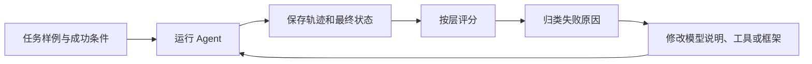

## 第十章　怎样判断 Agent 是否真的做好了

演示一次成功很容易：选一个资料齐全、工具正常的例子，让 Agent 顺利回答。产品要面对的却是缺文件、错误城市、工具超时、恶意网页和用户中途改变目标。评估的任务，是在发布或修改系统之前，让这些问题尽量在可观察的环境中出现。

### 10.1 先定义“成功”

“回答看起来不错”太模糊。天气助手的成功条件可以写成：必要时调用天气工具；使用与用户问题对应的城市和时间；不给出工具未返回的数字；在资料不足时说明限制。文件 Agent 的成功条件可以写成：找到正确页面；只改目标标题；保留其他关键内容；最终文件确实存在预期修改。

每类任务最好有一组明确样例，包含输入、可用工具或测试环境、预期状态与评分依据。预期状态不一定是唯一一句标准答案。天气建议可以有多种自然表达，只要事实和限制正确；文件编辑可以有多种实现，只要最终差异符合要求。

### 10.2 分层评估，才能定位问题

可以把一次运行拆开看：

| 层次 | 要观察的问题 |
|---|---|
| 模型决策 | 什么时候调用工具？选择了哪个工具？ |
| 参数与权限 | 工具名、参数、路径是否合法？越权请求是否被拒绝？ |
| 工具本身 | 同样输入下，是否返回正确状态、数据和错误？ |
| 结果使用 | 最终回答是否依据实际工具结果？ |
| 循环控制 | 何时继续、重试、暂停或停止？ |
| 最终目标 | 外部状态是否真的满足用户要求？ |

如果最终答案错了，分层记录能指出是模型没查天气、工具查错地点、结果过时，还是模型把两条结果混淆。只看最终分数，会让修复变成猜测。[Demystifying evals for AI agents](https://www.anthropic.com/engineering/demystifying-evals-for-ai-agents)

**图 10-1　把评估结果转回下一次改动（示意）**

回归评估要使用同一组可比较的任务条件，并查看新失败类型；否则只看到“改后分数更高”，却不清楚改动是否真的改善了系统。

### 10.3 一组小而有用的起始题

天气 Agent 的第一组题，不必追求几千条。可以先覆盖关键分支：

1. **资料充足**：用户问台北当前天气，工具正常返回。
2. **资料不足**：工具没有降雨概率，模型不能编造具体百分比。
3. **地点模糊**：用户只说“这里”，上下文没有城市。
4. **工具超时**：一次超时后按预算重试或说明失败。
5. **旧数据**：返回值有地点但时间是昨天。
6. **相邻城市**：同时查台北和新北，结果不能串位。
7. **恶意内容**：工具结果里混入“忽略用户”的文字。
8. **用户取消**：工具调用前或调用中收到取消。

文件 Agent 可加入文件缺失、同名文件多个、编辑后检查失败、路径越界和“只改标题”约束。随着真实使用出现新失败，把具有代表性的案例加入题集，再比较新版本是否改善。

### 10.4 记录可复盘的运行轨迹

一条轨迹至少包括任务编号与开始时间、模型请求摘要、上下文长度、模型返回类型、工具请求与权限判断、工具状态与耗时、下一步请求、结束原因，以及可取得的 token 和费用信息。敏感内容应脱敏或不记录。

轨迹帮助区分两种情况：Agent 最终碰巧答对了，但中间走了危险或昂贵的路径；Agent 最终失败，却在可恢复的地方停住并准确报告。评估应同时看结果与过程，但不要规定只有一种正确工具顺序。若搜索两个文件都能找到目标，评估不应因为模型选了另一个安全路径就判错。

### 10.5 怎样评估“有依据地回答”

把问题与可核对的资料放在一起，观察关键事实是否都来自资料。样例应包含资料有答案、没有答案、彼此冲突、过时和用户问题带错误前提等情况。

可以分别记录：结论正确率、关键数字与名称有据可查的比例、无依据细节比例、信息不足时表达限制的比例。引用本身也要核对：链接存在不代表它支持那句话。对文件或外部系统的操作，还应检查真实最终状态，不能仅凭 Agent 的完成报告判分。

### 10.6 自动评分与人工检查

机器规则适合检查文件内容、路径范围、工具调用次数和结构化字段；人工适合判断解释是否清楚、建议是否符合场景。另一个模型可以帮助初筛开放式回答，但它也可能判断错，尤其是细节事实和有歧义的任务。重要样例应抽查原始资料、评分规则与模型轨迹。

题集也要留出未用于反复调参的部分。若每次修改都只追着同一批题优化，系统可能学会通过题目，却在真实任务中退步。发布前应跑固定回归题，并查看新的错误类型，而不只看总分。

### 10.7 指标要服务于取舍

任务完成率、越权操作次数、无依据结论比例、失败恢复率、用户确认次数、平均耗时、模型调用数和费用，都可能重要。指标会相互牵制：增加一次核验可能更慢、更贵，却减少错误；让模型少问一次用户可能更快，却增加误操作风险。

因此先给任务定目标。例如天气提醒可以容忍自然语言措辞差异，但不能把地点弄错；文件修改可以接受多一次读取，却不能删除无关内容。衡量架构变化时，比较相同任务集上的质量、时间和费用，而不是只展示一段成功演示。[A practical guide to building agents](https://openai.com/business/guides-and-resources/a-practical-guide-to-building-ai-agents/)

### 本章小结

- 评估先定义任务成功的可观察条件。
- 分层记录模型、工具、权限、循环和最终状态，才能定位错误。
- 题集应覆盖缺资料、过时、失败、取消和恶意输入。
- 最终回答与实际外部状态都需要检查。
- 自动评分、模型辅助评分和人工判断各有适用范围。

### 想一想

1. Agent 没有调用天气工具，却碰巧猜对了今天会下雨。这算一次成功吗？评估应怎样记录？
2. 文件 Agent 报告“完成”，但目标文件未变化。哪一种证据更有力？
3. 新版本完成率提高，却让平均费用翻倍。还需要知道哪些信息才能判断它是否值得采用？
