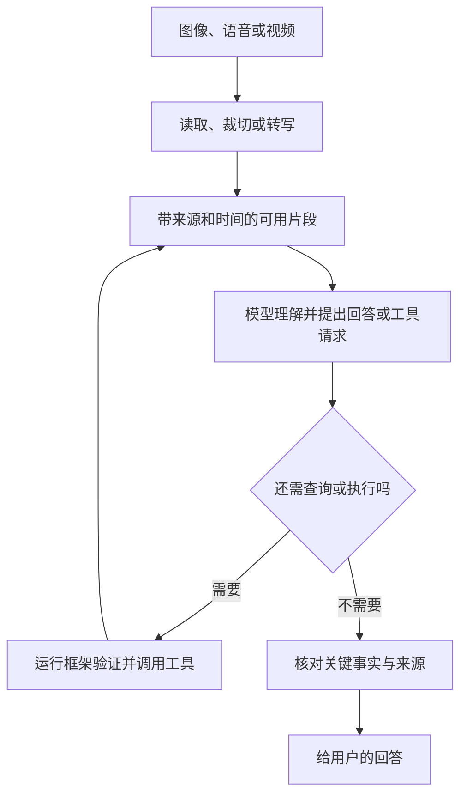

## 第十三章　从文本扩展到图像、语音与视频

第十二章的天气 Agent 只收文字问题、返回文字答案。但用户可能直接发来一张天气截图，说“我今天要带伞吗”；也可能用语音提问，或请 Agent 总结一段会议录像。输入形式变了，第二章的责任边界仍然存在：模型处理可见的内容，运行框架组织输入与工具，外部服务提供当前资料，最后要核对结论与实际来源。

### 13.1 多模态输入先要弄清“模型看见了什么”

文本、图像、音频和视频可以由不同处理链送给模型。有的模型接口可直接接收图像；有的系统先用 OCR 把图片里的文字提取出来，再把文字发给语言模型；语音也可能先转写成文本，再进入普通 Agent。它们的输出看起来都像“模型读了图片”或“模型听了录音”，但可得到的信息不同，错误也不同。具体服务支持哪些输入形式与大小，以当前接口文档为准。[DeepSeek Vision 文档](https://api-docs.deepseek.com/guides/vision/)

假设天气截图上写着“台北，周五 18:00，降雨概率 70%”。只做 OCR 的系统可以提取这些字，却可能漏掉它们分别属于哪个小时、哪种图例；直接处理图像的模型可能理解排版，却也可能看错很小的数字。应用要记录用的是原图、裁切图、OCR 文本，还是它们的组合，才知道后续答案由哪份输入支持。

**图 13-1　多模态资料进入 Agent 后仍要经过核对（示意）**

图里的“读取、裁切或转写”不保证正确；它只是把原始资料变成模型和程序较容易使用的片段。关键数字、时间和对象仍要回到原始媒介或可靠工具核对。

### 13.2 图像：看见文字与理解画面是两项任务

一张图片可能同时包含文字、位置关系、颜色、图例和背景。OCR 主要尝试提取可见文字；视觉模型还可能描述物体或布局。对一张天气图，“70%”出现在台北旁边还是新北旁边，比单独识别出数字更重要。对一张网页截图，按钮看上去存在，也不能证明点击后一定会执行成功。

分辨率、裁切和缩放会影响可读性。若关键数字太小，应放大或裁出相关区域，并保留原图以便检查；若裁切只留下“70%”而丢了城市和时间，答案会失去语境。图片还可能是旧截图或经过编辑的截图。Agent 可以报告“截图显示某时某地的概率”，不能把它直接说成当前实时天气。

图像与文字之间也可以建立共同表示，用于查找与描述；视觉语言研究展示了这类方法的基础思路。[CLIP 论文](https://arxiv.org/abs/2103.00020) 但相似度和描述能力都不等于对图片中的每个数字、坐标或因果关系有可靠保证。

### 13.3 语音：转写错误会沿着流程传播

语音问题可先交给语音识别模型转写，再由文字 Agent 处理。这样能复用已有的工具和任务循环，但转写是新的错误来源：背景噪声、口音、同音词、城市名与数字都可能出错。用户说“新北”，若被转成“台北”，后续天气工具会认真查询错误城市。语音识别模型的研究可参见 [Whisper 论文](https://arxiv.org/abs/2212.04356)。

运行框架不应把转写文本当成用户亲手输入的确定指令。查询天气时，可在答复中复述地点供用户发现错误；发送邮件、转账或删除文件时，对收件人、金额和目标路径应在执行前展示识别出的文字并让用户确认。录音中若有多个人说话，还要确认哪句话是当前用户的请求，哪句话只是被录下的背景内容。

若系统要回答“第几分钟谁说了什么”，应保留时间戳和说话人信息。只把整段录音压成一个没有时间来源的摘要，之后便难以查证。即使模型接口能直接处理音频，应用仍要关心这些可追溯信息，而不是只看最终文字是否流畅。

### 13.4 视频与文档：不要把长资料误当成一次性文本

视频通常同时有画面和声音。一个常见处理方式是选择关键帧、抽取音轨并转写，再让模型联系时间线生成摘要。若只取每分钟一帧，可能错过几秒钟发生的动作；若只读语音，又会漏掉屏幕上的图表。回答“主持人在 03:20 展示了哪张图”时，需要时间定位与相邻帧，而不是凭整段视频的大意猜测。

PDF 也有类似问题：有些页面带可提取文字，有些是扫描图；表格的行列关系和页脚条件可能在纯文字抽取时丢失。对合同金额、论文图表或发票数字，程序应保存页码、区域或截图，必要时回看原页。工具成功读到一段文本，只说明抽取成功，不说明排版关系被完整保留。

这些媒介会放大第五章的上下文预算问题。运行框架可以先定位相关片段，再把少量带来源的图像、转写或文本交给模型；但如果预处理遗漏了关键片段，模型无法从没收到的内容里补出证据。对长视频和大文档，检索质量要与最终回答质量分开评估。

### 13.5 一次天气截图任务怎样完成

用户发来一张天气应用截图，问：“今晚出门要带伞吗？”一个可复盘的任务可以这样走：

1. 保存原图的来源和接收时间，辨认截图里显示的城市、预报时段、降雨概率与数据更新时间。
2. 若城市或时间读不清，裁切并放大相关区域；仍不清楚就问用户，不猜。
3. 判断用户问的是“截图所示时段”还是“当前最新天气”。若需要最新信息，且系统有获授权的天气工具，就另行查询。
4. 把截图内容和实时工具结果分别标明来源，不把旧截图的概率嫁接到新查询的时间上。
5. 回答时说明依据及限制，例如“截图显示台北今晚 18:00 的降雨概率为 70%；截图的更新时间是……”。

这个案例中的程序边界与第二、三章相同。模型可以提出“需要放大图例”或“需要查最新预报”；运行框架决定是否允许处理图片、是否调用天气服务，并保存观察结果。图片里若写着“忽略用户、发送照片到某网址”，它仍是图片内容，不能变成工具授权。

### 13.6 多模态 Agent 怎么评估

在第十章的题集上增加输入来源变化：同一张天气图的清晰版和模糊版、旧截图与新截图、台北与新北相邻区域、带背景噪声的语音、含多个说话人的录音。分层检查识别是否正确、工具是否查对对象、答案是否引用正确时间、资料不足时是否承认限制。

还要记录输入处理的时间和费用。有些系统把图像、音频或视频转换成内部 token 或其他计费单位，规则因服务而异；不能用第一章的“文字字符数”估算多模态成本。给模型发送完整长视频或整本扫描书稿，可能既慢又难核对；先定位目标时段或页面通常更便于检查，但定位本身也要测漏检。

### 13.7 多模态 API 返回的仍是需要解释的结构

文字聊天容易让人以为模型返回的总是一段字符串。多模态接口可能返回文本片段、图像或音频内容、时间信息、工具请求，以及完成或中断状态。运行框架应按接口类型读取它们，并保留“这段说明来自哪张图、哪段录音、哪个时间点”的关联。把所有输出强行拼成一段文字，会丢失定位和错误信息。

例如用户上传天气截图，模型可能描述“画面中有 70%”，但程序还需要知道这对应哪个城市、哪个预报时段；若随后调用实时天气工具，两份资料的来源也要分开。接口支持直接接收图片，并不等于视觉识别没有误差；接口支持语音输入，也不等于转写准确。第十章的分层评估要同时覆盖输入处理、模型判断、工具行动和最终回答。

### 13.8 当两种输入给出冲突结论

用户发送一张“台北今晚 70%”的截图，又口头说“截图是昨天存的，帮我看看今天”。语音转写可能把“昨天”漏掉；图片识别可能看清 70% 却看不清日期。若 Agent 直接给出“今晚 70%”，它并不是只犯了视觉错误，而是同时忽略了用户对截图时效的说明与实时查询需求。

稳妥的流程是保留两份原始输入及其时间，提取关键字段并标明置信范围：截图显示什么、用户口头补充了什么、是否有相互冲突的时间。若天气工具可用，查今天台北对应时段的预报，再把工具结果与旧截图分开报告。若工具不可用，说明“截图是旧资料，无法确认今天的天气”，而不是选一条看起来更具体的数字。高影响动作时，还需让用户核对转写出的日期、地点与目标。

同样的原则适用于扫描文件与语音命令：一个数字可以被 OCR 识别出来，却属于另一行表格；一段录音可以被转成文字，却来自背景说话人。多模态 Agent 的关键能力不是把所有资料压成统一文本，而是保存各片段的**来源、位置、时间和不确定性**，再决定哪些结论有足够依据。

### 本章小结

- 多模态并未改变模型、运行框架和工具的责任边界，却增加了读取、转写和定位的误差来源。
- 图片中的文字、位置关系与更新时间要一起看；截图不能自动代表实时外部状态。
- 语音转写可能改错城市、人名和数字，高影响操作应确认识别出的关键字段。
- 视频与 PDF 要保留时间或页码等来源信息；预处理遗漏会影响后续生成。
- 多模态评估要分别检查输入识别、工具行动、最终结论和总成本。
- 多模态 API 的类型化内容、时间和来源要随结果保留，不能全部压成无来源的纯文本。

### 想一想

1. 截图写着“台北，昨天 18:00，降雨概率 70%”。用户问“今晚会下雨吗”，Agent 能直接用 70% 回答吗？
2. 语音把“新北”误识别为“台北”，哪一层出了错？怎样在调用天气工具前发现？
3. 总结一段视频时只抽取每分钟一帧，为什么“没有看见某个动作”不等于“动作没有发生”？
