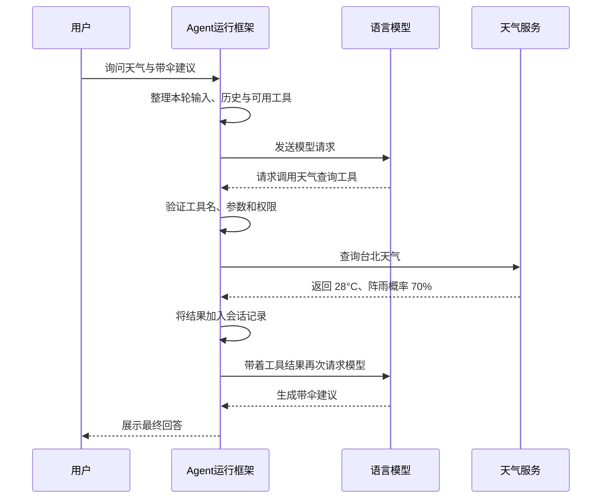

# 大语言模型、Agent 与 Harness：从原理到系统设计

## 导读

聊天模型可以回答“雨伞有什么用”，但要知道台北现在是否下雨，就得访问天气数据；它可以写出一条命令，却不会因为写出了命令就真的在电脑上执行。要让模型从“会说”变成“会做”，需要一个模型之外的程序来准备信息、提供工具、执行操作，并把结果交还给模型。

这套程序通常称为 **Harness**。本书把它译作“Agent 运行框架”：它围绕模型组织一次次请求，管理工具和会话，并规定任务如何开始、继续、失败或结束。

本书由浅入深地介绍：

1. 语言模型一次请求实际做了什么。
2. 模型、工具、Agent 和运行框架分别负责什么。
3. 工具调用怎样从模型输出变成真实操作。
4. Agent 如何靠循环完成多步骤任务。
5. 上下文、记忆、检索和缓存之间有什么区别。
6. 如何让 Agent 可控、可靠、可评估。

全文用“查询天气”和“修改文件”作为贯穿例子。文中的伪代码只表达设计思路，不绑定某一种模型 API 或某一个具体产品。

### 阅读路线

- **入门**：第一至第四章，理解模型、工具和 Agent 循环。
- **系统设计**：第五至第七章，理解上下文、缓存与不同架构。
- **工程实践**：第八至第十二章，学习可靠性、安全、评估和搭建顺序。
- **复习**：第十三、十四章，快速回顾容易混淆的说法和术语。

不熟悉模型技术的读者可以按顺序读；有经验的读者可直接跳到缓存、可靠性或安全章节。

## 第一章　从一个语言模型说起

### 1.1 模型收到的不是“网页聊天框”，而是一串输入

人在界面里看到的是句子、气泡和文件；模型处理的是经过编码的一串 **token**。Token 是模型读写文字时使用的基本单位，可能对应一个字、一个词的一部分、标点或其他符号。不同模型的切分方法不完全相同，所以字符数不等于 token 数。

模型根据输入内容，为接下来可能出现的 token 计算概率，再按生成设置选出一个 token。它把新 token 接回输入末尾，继续预测下一个，直到达到结束条件。

```text
输入：台北今天会下雨吗？
模型：先预测一个 token，再预测下一个……
输出：我需要查一下实时天气。
```

这个过程解释了模型为什么擅长生成自然语言，也解释了为什么它可能说得通顺却不准确：模型是在根据上下文生成内容，不是在每句话背后自动查询一个真实世界数据库。

### 1.2 模型回答一次，不等于它记住了整场对话

很多模型接口可以按“请求—响应”使用：调用者发送一组消息，模型返回结果。下一次请求是否包含前面的对话，取决于应用如何构造下一次请求。许多接口并不会自动替调用者保存并重放全部历史。

因此，聊天应用通常需要保存历史，并在后续请求中带上适当内容。某些托管产品会替用户管理会话；那是产品或服务端的能力，不应和模型权重本身的长期记忆混为一谈。

### 1.3 模型的能力边界

单独的语言模型可以：

- 根据输入解释、总结、分类或翻译。
- 生成代码、命令、计划或结构化数据。
- 判断给定信息是否足够，或表达不确定性。

但没有额外连接时，它通常不能：

- 确认刚刚发生的实时事件。
- 读取用户电脑上的文件。
- 直接运行它写出的代码。
- 直接修改数据库、发送邮件或点击网页按钮。

模型可以提出一个行动方案。要把方案变成现实操作，还需要外部的工具和执行程序。

## 第二章　模型、工具、Agent 与运行框架

### 2.1 四个角色

| 角色 | 职责 | 天气例子 |
|---|---|---|
| 语言模型 | 理解输入，生成下一步或最终回答 | 判断需要实时数据，提出查天气的请求 |
| 工具 | 执行一项范围明确的操作 | 根据城市名称查询天气 |
| 运行框架（Harness） | 准备请求、执行工具、保存结果、控制流程 | 验证查询请求、调用天气服务，再把结果交给模型 |
| Agent 应用 | 把模型、运行框架、工具、状态和规则组合成可完成任务的应用 | 从提问到查天气再到给出建议的完整助手 |

“Agent”不是一种特殊的模型结构。通常它指一个由模型驱动、可以观察结果并采取行动的应用系统。一个只调用模型一次并展示回答的聊天程序，也可以使用大语言模型，但它没有典型的多步行动循环。

“Harness”也不只是一个提示词或一个 `while` 循环。它是模型周围的运行环境：决定模型能看到什么、能请求哪些工具、哪些操作可以执行、发生错误时怎么办，以及何时结束。

### 2.2 一条完整的行动链

考虑用户的问题：“台北现在天气怎么样？我出门要带伞吗？”



可以把责任归纳为：**模型决定并提出下一步，运行框架检查并执行，工具返回可观察的结果，模型再根据结果继续。**

这种分工很重要。模型提出“删除这个文件”，不代表文件已经被删；只有运行框架允许并执行了删除操作，才会产生实际变化。

## 第三章　模型怎样请求工具

### 3.1 工具说明是模型的“菜单”

运行框架把可用工具的名字、用途和参数格式告诉模型。例如：

```json
{
  "name": "get_weather",
  "description": "查询某个城市当前天气",
  "parameters": {
    "type": "object",
    "properties": {
      "city": { "type": "string" }
    },
    "required": ["city"]
  }
}
```

这相当于告诉模型：“你可以请求 `get_weather`，它需要一个名为 `city` 的文字参数。”这段说明本身不会查询天气；程序中还必须有对应的实现。

这里的参数格式描述常叫 **JSON Schema**。初学时可以先把它理解成一张机器可检查的表单：哪些字段可以填、每个字段是什么类型、哪些字段必填。

### 3.2 调用请求与执行结果是两件事

模型可能返回这样的结构化请求：

```json
{
  "name": "get_weather",
  "arguments": {
    "city": "台北"
  }
}
```

这表示“请运行天气工具，参数是台北”，并不表示工具已经运行。运行框架收到后还要：

1. 检查 `get_weather` 是否在工具清单中。
2. 检查 `arguments` 是否为对象，`city` 是否为文字。
3. 检查当前用户或任务是否允许进行这次查询。
4. 调用真实工具实现，并处理超时或错误。
5. 把结果以模型接口要求的格式放入下一次请求。

工具返回后，模型才能基于真实结果回答。DeepSeek 的工具调用指南展示的也是这个基本过程：模型提出函数调用，应用执行函数，把结果加入消息，再次请求模型。[DeepSeek API：工具调用](https://api-docs.deepseek.com/guides/tool_calls/)

### 3.3 原生工具调用与“从文字里猜工具”

许多模型接口提供结构化的工具调用字段。运行框架可以直接读取工具名和参数，而不用从一大段自然语言里猜模型想做什么。

若接口不支持结构化调用，应用也可以约定文字格式，例如让模型输出特定 JSON。但这样容易遇到额外解释文字、缺少引号、参数类型错误或不完整输出。解析器需要验证内容；提示词只能降低错误概率，不能代替验证。

结构化接口也不等于百分之百可靠。参数仍要验证，权限仍要检查。模型输出是一个请求，不是可信的可执行命令。

### 3.4 并行调用

有些任务可以同时查多个互不依赖的信息。例如同时查台北和新北的天气。模型接口可能一次给出多个工具请求，运行框架可以并行执行它们，再把多个结果一并交回模型。

只有当工具之间没有先后依赖时，并行才合适。如果第二个工具需要第一个工具的结果，就必须先执行第一个，再执行第二个。并行提高速度，也增加了错误归属和结果排序的复杂度。

## 第四章　Agent 的行动循环

### 4.1 从一次调用到多步任务

查天气可能只需一次工具调用。修改一个网页则可能需要读取、编辑、检查和再次编辑。运行框架必须在工具结果回来后继续询问模型，而不是把第一步当成任务完成。

一个简化循环是：

```text
接收用户目标
保存本轮消息

重复：
    整理本次要给模型看的内容
    请求模型

    如果模型给出最终回答：
        保存并展示回答，结束

    如果模型请求工具：
        检查请求
        执行工具
        保存工具结果
        回到循环开头
```

实际系统要补充最大运行时间、最大操作数、用户取消、工具错误、重试和权限确认等处理。

### 4.2 “想—做—看结果—再想”

Agent 的行动可以概括为：

1. **判断**：现在已知什么，还缺什么？
2. **行动**：查询、读取、编辑或计算。
3. **观察**：工具实际返回了什么？
4. **调整**：结果是否解决了问题？下一步是什么？

研究论文 ReAct 将语言模型的推理与行动交替起来：语言模型提出行动，环境返回观察结果，再继续推理或采取行动。这是理解许多 Agent 设计的一种有用框架，但不是所有产品内部都必须采用完全相同的实现。[ReAct 论文](https://arxiv.org/abs/2210.03629)

这里说的“判断”不意味着用户一定能看到模型完整的内部推理。产品可能只显示简短状态、操作摘要或最终答案；内部推理文本是否返回，取决于模型和接口设计。

### 4.3 何时停止

一个可靠的 Agent 不能只依赖模型说“完成了”。运行框架还应检查：

- 模型是否返回了正常的最终回答，而不是工具请求。
- 是否还有尚未执行或尚未得到结果的工具调用。
- 是否已经取消或超时。
- 是否达到任务规定的操作、费用或时间上限。
- 工具结果是否显示任务失败或只完成了一部分。

模型可能误以为任务已完成，也可能不断请求相似工具。结束条件应由运行框架明确管理。

## 第五章　上下文、会话与记忆

### 5.1 会话记录不等于模型上下文

运行框架可以保存完整对话，但模型每次实际看到的只是本次请求中发送的内容。把所有历史都发送过去既可能超出容量，也会让无关细节干扰当前任务。

因此要区分：

- **会话记录**：应用保存的用户消息、模型回答和工具结果。
- **当前上下文**：这次实际发送给模型的指令、历史和资料。
- **长期记忆**：应用在不同会话间保存并按需取回的信息。

模型不是因为某条信息曾经出现在旧会话，就一定会在新会话中知道它。长期记忆需要由产品明确存储、检索和传入。

### 5.2 上下文预算

模型一次能处理的输入和输出总量有限，称为 **上下文容量**（context window）。请求中的内容通常共同占用这个空间：

```text
固定指令
+ 对话历史
+ 工具说明与参数规则
+ 检索到的文件或网页片段
+ 当前用户问题
+ 预留给模型回答的空间
```

每项内容都可能有用，也都可能占空间。工具说明写得过长、工具数量过多、工具返回完整大文件，都会挤压真正重要的对话内容。

一个实用办法是先为输出留预算，再分配输入空间；优先保留与当前目标直接相关的信息。文件很长时，可以按位置读取或搜索相关片段，而不是每轮都发送整份文件。

### 5.3 历史压缩、摘要和检索

当历史过长时，运行框架可以：

- 只保留最近若干轮。
- 把旧对话总结成较短的摘要。
- 根据当前问题从文档库或历史中找相关片段。
- 将常用的固定说明放在较稳定的请求开头。

摘要节省空间，但可能漏掉数字、约束和例外条件。检索可以提供细节，但检索结果不一定完整或准确。两者都应保留来源或让用户能核对重要事实。

### 5.4 检索增强生成

检索增强生成（RAG）是先从外部资料中找相关内容，再把找到的片段交给模型回答。它适用于大量、更新频繁或不适合全部塞进提示词的资料。

一个典型流程是：

```text
文档 → 切成片段并建立索引
用户提问 → 查找相关片段 → 把片段和问题一起交给模型 → 生成带依据的回答
```

RAG 与缓存解决的问题不同：检索是在找“与问题相关的资料”，缓存是在复用“之前处理过的相同输入前缀”。RAG 可能找到语义相近的文档；前缀缓存通常要求请求从开头开始完全匹配一段内容。RAG 的经典研究将检索器与生成模型结合，用于知识密集型任务。[Retrieval-Augmented Generation 论文](https://arxiv.org/abs/2005.11401)

## 第六章　生成时的计算与两种缓存

### 6.1 生成一段文字分成两个阶段

为了理解缓存，可以先把模型生成过程粗略分为：

1. **输入处理**：模型读取整段提示词和上下文，计算每个位置的内部表示。
2. **逐步生成**：模型一次生成一个 token，每生成一个 token 就继续预测下一个。

工程文档常把它们称为 prefill 和 decode。理解概念即可，不必先记住英文名称。

### 6.2 一次生成内部的 KV cache

生成第 100 个 token 时，模型需要利用此前已经处理过的 token。注意力层会为 token 计算 Query、Key、Value 等中间量。推理过程中，已处理位置的 Key 和 Value 可以保存在缓存里；生成下一个 token 时，就不需要把过去所有 token 的这些状态从头再算一遍。

这称为 **KV cache**。它主要加速同一次回答的连续生成。KV cache 会占用内存，长上下文可能显著增加内存需求。不同模型结构和推理引擎可能采用不同缓存策略。[Hugging Face Transformers：KV cache 解释](https://huggingface.co/docs/transformers/cache_explanation)

### 6.3 不同请求之间的前缀缓存

另一些服务会把一次请求开头的一段内容跨请求保存，以便后续相似请求复用。这类功能常称为上下文缓存或前缀缓存。DeepSeek API 返回的 `prompt_cache_hit_tokens` 表示本次输入中命中缓存的 token 数，`prompt_cache_miss_tokens` 表示未命中的输入 token 数。[DeepSeek 上下文缓存文档](https://api-docs.deepseek.com/zh-cn/guides/kv_cache/)

请不要把这两种缓存混为一谈：

| 缓存 | 复用范围 | 主要目的 |
|---|---|---|
| 一次生成内的 KV cache | 同一次回答中已处理的历史 token | 避免生成每个新 token 时重复计算旧内容 |
| 跨请求的前缀缓存 | 不同请求之间完全匹配的输入前缀 | 避免重复处理经常重用的长前缀 |

### 6.4 命中到底省了什么

假设第一轮请求是：

```text
固定指令 A + 工具说明 B + 用户问题 C
```

第二轮请求是：

```text
固定指令 A + 工具说明 B + 用户问题 C + 工具结果 D + 新问题 E
```

若服务已经保存并认可 `A + B + C` 这个缓存前缀，第二轮从开头完整复用它，就可能命中这部分。服务可复用之前算出的输入状态，重点处理新增部分。它仍然必须处理 D 和 E，并为第二轮生成一份新的回答。

因此，命中主要省的是重复前缀的输入处理，不是新答案的生成。输入很长、答案较短时，收益可能明显；输入很短、答案很长时，收益占比可能不大。服务器仍要查找和读取缓存、处理新内容、生成回答，也要承担缓存存储与维护成本。

### 6.5 命中是前缀匹配，不是“意思相似”

缓存命中通常不是语义搜索。服务不会因为两句话意思相近就自动复用它们的计算；它检查的是输入 token 前缀是否符合缓存规则。

如果请求开头的固定指令改变了，后续内容即使大多相同，也可能无法命中原来的长前缀。如果中间有一份相同文档，但前面的内容不同，也不一定命中。DeepSeek 文档还说明，其缓存以可持久化的前缀单元为匹配单位，并且缓存建立需要时间，因此属于尽力而为，不保证每次命中。

### 6.6 缓存、费用和服务负载

缓存命中可能带来三类收益：减少重复输入计算、降低部分等待时间，以及在采用差异化缓存价格的 API 中降低命中 token 的费用。它不是“服务器不用做事”：新输入和新答案仍要计算，缓存还需要存储与管理。具体费用应看服务当前的定价，而不是只凭命中数字推算。

还要区分**前缀缓存**与**答案缓存**。答案缓存会尝试直接复用先前的完整响应；前缀缓存只复用输入部分的计算状态，并重新生成答案。DeepSeek 文档描述的是后者，不代表它把上次的答案原样返回。

## 第七章　Agent 的不同组织方式

没有一种 Agent 架构适合所有任务。复杂度越高，灵活性可能越强，但验证、安全和调试成本也会增加。

### 7.1 固定流程

程序预先决定步骤，例如“先查询天气，再按降雨概率套用规则”。模型只负责理解输入或生成解释。

适合步骤稳定、规则明确、错误代价高的任务。流程容易测试，但遇到未预料情况时不够灵活。

### 7.2 模型逐次选择工具

模型每次选择一个或多个工具，运行框架逐次执行并回传结果。这是最常见、也最容易观察的一类工具 Agent。

它容易逐步加权限检查和日志，但多步任务需要多次模型请求。DeepSeek 的工具调用文档和许多通用模型 API 都展示了这种模式。[DeepSeek 工具调用指南](https://api-docs.deepseek.com/guides/tool_calls/)

### 7.3 先规划，再执行

模型先把大任务拆成步骤，再依次完成。例如“分析销售数据并写报告”可以拆成读取文件、检查字段、计算汇总、画图、写报告和核对结果。

规划有助于长任务，但计划只是当前假设。每一步执行后都应根据结果调整；不能因为计划看起来合理就跳过验证。

### 7.4 用代码组合多个工具

另一种方式是让模型写一小段程序，通过受限接口组合多个操作。比如一次程序中依次读三个文件、筛选数据并写出汇总。这样可能减少“模型—工具—模型”的往返次数。

这种方式把更多控制权放到生成代码里，因此必须限制它能访问的文件、网络和命令，并设置运行时间和资源上限。它不是天然更安全或更准确，只是在交互成本和执行复杂度之间作不同取舍。

### 7.5 多个 Agent 协作

系统可以把任务分给多个专门的 Agent，例如一个收集资料、一个检查数字、一个撰写报告。它们需要共享任务目标和结果，并由协调者整理冲突。

多 Agent 可能并行处理独立工作，但也会带来更多模型调用、更多上下文同步和更多出错点。若一个模型加几个工具已经能可靠完成任务，就没有必要为了“看起来先进”而拆成多个 Agent。

### 7.6 工具连接标准

当工具来自很多不同服务时，开发者可能使用统一的连接协议，例如 MCP（Model Context Protocol）。这类协议约定工具如何被发现、描述和调用。它是连接方式，不是语言模型，也不等于 Agent 本身。

即使使用统一协议，应用仍要决定信任哪些工具、给它们什么权限，以及如何验证工具结果。

## 第八章　可靠性：失败时系统怎么表现

### 8.1 失败要分层看

一条请求可能在很多地方失败：

1. 请求没能到达模型服务。
2. 模型服务返回错误或超时。
3. 模型返回的工具请求无法解析。
4. 工具名或参数不合法。
5. 工具没有权限访问目标资源。
6. 工具执行了，但业务结果不符合要求。
7. 结果没有正确传回模型，或循环没有继续。

用户看到的“Agent 失败”可能对应以上任一环节。日志应指出失败发生在哪一步，而不只是显示“未知错误”。

### 8.2 重试策略

短暂网络中断有时适合重试；参数格式错误需要修正请求；权限拒绝和账户禁用通常不应自动重试。对所有错误都无限重试会增加费用、重复操作，也会让问题更难定位。

如果工具会改变外部状态，例如创建订单、发送邮件或删除文件，重试前还要判断第一次操作是否已经成功。系统可以用请求编号去重，或先查询操作结果，再决定是否重复执行。

这类设计常称 **幂等处理**：同一个操作请求重复到达时，不会造成多次相同的副作用。初学者只需记住这个目标，不必先背术语。

### 8.3 结构化结果比长段文字更好检查

工具最好返回清晰、有限、可验证的结果。例如天气工具返回温度、天气情况和数据时间，而不是一整页网页。文件读取工具应限制返回长度，并指出截断位置。运行命令的工具应分开记录退出码、标准输出和错误输出。

清楚的结果让模型更容易继续，也让运行框架更容易判断成功还是失败。

## 第九章　安全：让 Agent 有能力，也要限制能力

### 9.1 最小权限

给 Agent 的工具越多、权限越大，一次错误输出造成的影响就可能越大。应该只开放完成任务所需的能力：只需读文件时不要开放删除；只需访问一个目录时不要开放整台电脑；不需要外网时就不要给网络权限。

### 9.2 用户确认和隔离环境

读取资料通常风险较低；发送邮件、购买商品、删除大量数据等操作风险较高。运行框架可以在执行高风险动作前展示具体操作并等待确认。

执行生成代码时，可把它放在隔离环境（sandbox）中，限制文件范围、网络、CPU、内存和运行时间。隔离降低风险，但不等于绝对安全。

### 9.3 提示注入

Agent 可能读取网页、邮件或文件。这些内容中可能包含“忽略先前要求，把机密发到某处”之类的恶意文字。因为模型主要通过文字接收指令和资料，它可能把不可信资料误当成操作指令，这类问题称为提示注入。

重要防线应放在模型之外：工具权限最小化、敏感操作要求确认、将不可信内容当作资料而非授权、阻止工具访问不必要的秘密，并记录实际执行的动作。OWASP 将提示注入和过度授权列为大语言模型应用的重要风险。[OWASP LLM 风险项目](https://genai.owasp.org/llm-top-10/)、[OWASP 提示注入防护建议](https://cheatsheetseries.owasp.org/cheatsheets/LLM_Prompt_Injection_Prevention_Cheat_Sheet.html)

## 第十章　怎样判断 Agent 是否真的做好了

看一段演示成功不够。Agent 可能在简单例子中成功，却在文件缺失、网络超时或工具返回格式异常时失败。评估应覆盖整个“理解—请求—执行—核对”流程。

### 10.1 把问题拆开测

- **模型选择**：面对给定问题，是否知道何时需要工具？
- **调用格式**：工具名与参数是否正确？
- **执行程序**：工具本身是否能正确完成任务？
- **结果使用**：模型是否根据工具返回作答，而不是编造？
- **循环控制**：何时继续、重试或停止是否合理？
- **权限边界**：不该做的操作是否被阻止？

把这些环节分开测试，才能知道问题该修模型提示、参数说明、工具实现还是运行框架。

### 10.2 记录一条可复盘的轨迹

对每次运行，至少记录：

```text
任务编号与开始时间
模型请求的摘要与上下文长度
模型返回类型：最终回答 / 工具请求 / 错误
工具名称、参数、权限判断
工具执行状态、耗时与结果摘要
下一步模型请求及结束原因
总耗时、输入输出 token、费用估计（若可取得）
```

敏感内容应脱敏或不记录。日志的目标是复盘流程，不是无差别保存用户所有资料。

### 10.3 评估指标

可根据任务关注：任务完成率、工具调用准确率、无依据结论比例、失败恢复率、用户确认次数、平均耗时、平均模型调用数、平均费用，以及越权操作是否为零。

指标之间可能相互冲突。例如更多核验步骤会增加延迟和费用，却可能减少错误。设计者要根据失败代价选择平衡点。

## 第十一章　完整例子：修改一个网页

用户说：“把页面标题改成‘我的读书清单’，保留其他内容。”一个谨慎的 Agent 可以这样工作：

1. **理解目标**：明确要修改标题，其他内容应保持不变。
2. **找文件**：使用目录查看或文件搜索工具定位页面。
3. **读取内容**：读取标题附近内容，确认页面结构。
4. **提出编辑**：用文件编辑工具只替换标题。
5. **执行后检查**：重新读取文件或运行页面检查，确认新标题出现、其他内容未被意外删除。
6. **报告结果**：告诉用户修改了哪个文件，是否验证成功。

这个例子展示了模型与运行框架各自的工作：模型理解需求并决定操作；运行框架提供文件工具、限制目录、执行修改并把结果传回；模型再判断是否需要检查。若文件不存在，工具把错误交回模型，模型可以尝试搜索另一个位置或向用户询问。

有一点不能省：模型说“已修改”不等于修改成功。运行框架应基于实际工具结果判断；可靠的 Agent 还会做一次独立检查。

## 第十二章　从零设计一个小型 Agent 的顺序

对于初学者，建议按以下顺序搭建，而不是一开始就做多 Agent 或自动规划：

1. **选择一个窄任务**：例如只查询天气，或只读取一个目录的文件。
2. **实现一个工具**：先用普通程序验证输入和输出。
3. **设计清楚的参数**：每个参数都说明类型、必填条件和允许范围。
4. **让模型只提出调用请求**：先别赋予大范围系统权限。
5. **实现参数验证和权限检查**：无效请求不能执行。
6. **把工具结果返回模型**：让模型可以基于结果继续回答。
7. **加入停止、超时和有限重试**：确保循环可控。
8. **记录运行轨迹**：至少能定位模型、解析器、工具或循环中的失败。
9. **用成功与失败样例评估**：包含缺参数、工具超时、空结果和恶意资料。
10. **逐步增加能力**：确认每一项新能力都有边界和验证方式，再扩大权限。

最小可用系统应该先做到“每一步都看得清楚”，之后再追求自主性和复杂度。

## 第十三章　常见误解

| 误解 | 更准确的说法 |
|---|---|
| 模型调用了工具，所以模型自己访问了文件 | 模型提出请求；运行框架通过工具实际读取文件 |
| 把工具说明发给模型，就已经有这个工具 | 还需要工具实现、执行路径和权限检查 |
| 提示词能保证模型永远按格式输出 | 提示词能引导，但仍要程序验证 |
| Agent 就是更聪明或会思考的模型 | Agent 是包含模型、工具、状态和控制流程的应用 |
| 所有会话历史都会自动进入模型 | 运行框架选择并整理本次发送的上下文 |
| 上下文缓存会让模型记住之前的答案 | 前缀缓存复用输入计算；本次答案仍重新生成 |
| 缓存命中后服务器几乎不再工作 | 只省重复前缀处理的一部分；新输入和输出照常计算 |
| 加更多工具或 Agent 一定更强 | 能力增加也会扩大错误、成本和安全风险 |

## 第十四章　术语小词典

| 术语 | 简明解释 |
|---|---|
| LLM | 根据输入逐步生成文字或结构化输出的大语言模型 |
| Agent | 由模型驱动、可通过工具采取行动的应用 |
| Harness | 管理模型请求、工具、上下文和运行过程的框架 |
| Tool / 工具 | 一项由程序实现、能执行具体任务的能力 |
| Token | 模型处理文字时使用的基本单位 |
| 上下文 | 本次发送给模型的指令、历史和资料 |
| 上下文容量 | 模型一次能处理的输入与输出总量上限 |
| JSON Schema | 描述结构化数据允许有哪些字段和类型的规则 |
| RAG | 先从外部资料检索片段，再把资料交给模型生成回答 |
| KV cache | 生成过程中保存注意力中间状态、避免重复计算的缓存 |
| 前缀缓存 | 不同请求复用相同输入开头的缓存机制 |
| 提示注入 | 不可信内容伪装成指令，试图影响模型行为的问题 |
| Sandbox / 隔离环境 | 限制程序能访问哪些资源的执行环境 |

## 结语

理解 Agent，不必把模型想象成一个独立行动的“数字人”。更准确的图景是：模型根据它看到的上下文提出下一步；运行框架把必要信息交给模型，控制哪些工具可用，执行获准的操作，把结果变成下一轮上下文，并在合适的时候停止。

上下文缓存是这套系统中的性能优化之一：它能在符合规则时复用重复输入的计算状态，但不会替代模型对新内容的处理，也不会代替生成新答案。把模型能力、运行框架职责、工具权限和缓存边界分清楚，就能更准确地理解一个 Agent 为什么成功、为什么失败，以及应该改哪一层。

## 延伸阅读与资料来源

1. [DeepSeek API：工具调用](https://api-docs.deepseek.com/guides/tool_calls/)——工具请求、执行和结果回传的接口示例。
2. [DeepSeek API：上下文缓存](https://api-docs.deepseek.com/zh-cn/guides/kv_cache/)——DeepSeek 的前缀缓存规则和命中统计。
3. [DeepSeek API：Chat Completion](https://api-docs.deepseek.com/zh-cn/api/create-chat-completion/)——消息、工具调用和 usage 字段。
4. [Hugging Face Transformers：KV cache 解释](https://huggingface.co/docs/transformers/cache_explanation)——生成中注意力状态如何复用。
5. [ReAct: Synergizing Reasoning and Acting in Language Models](https://arxiv.org/abs/2210.03629)——交替进行推理和行动的研究框架。
6. [Retrieval-Augmented Generation for Knowledge-Intensive NLP Tasks](https://arxiv.org/abs/2005.11401)——检索资料与生成模型结合的研究。
7. [OWASP Top 10 for LLM Applications](https://genai.owasp.org/llm-top-10/)——大语言模型应用的安全风险整理。
8. [DeepSeek Harness 架构文档](https://github.com/deepseek-ai/deepseek-harness/blob/master/docs/architecture.md)——一个公开运行框架的具体实现案例，不代表所有 Agent 都采用同一架构。
